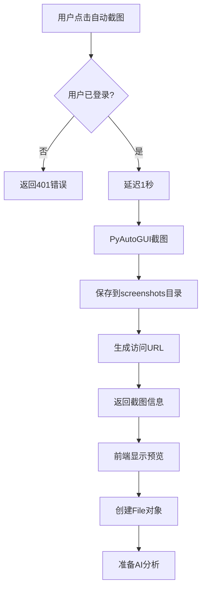

# 🚀 自动截图功能实现报告

**实现时间**: 2025-06-16 01:00  
**功能名称**: AI工作室自动截图功能  
**开发状态**: ✅ 完成

## 📋 功能概述

为Trustee智能任务执行助手的AI工作室添加了**一键自动截图**功能，用户现在可以：

1. **快捷访问** - 侧边栏导航直接跳转AI工作室
2. **自动截图** - 点击按钮即可自动截取当前屏幕
3. **无缝集成** - 截图自动加载到AI分析流程中

## 🔧 实现详情

### 1. 导航优化
**修改文件**: `templates/base.html`
- ✅ 在侧边栏添加"AI工作室"导航链接
- ✅ 使用psychology图标，符合AI主题
- ✅ 支持当前页面高亮显示

```html
<a href="{{ url_for('ai_studio') }}" class="nav-item active">
    <i class="material-icons">psychology</i>
    AI工作室
</a>
```

### 2. 前端界面增强
**修改文件**: `templates/ai_studio.html`

#### 📸 自动截图按钮
- ✅ 位置：上传区域下方，醒目位置
- ✅ 样式：绿色渐变，现代化设计
- ✅ 图标：camera_alt 相机图标
- ✅ 状态：支持加载状态和禁用状态

```html
<button id="autoScreenshotBtn" onclick="captureScreenshot()" 
        style="background: linear-gradient(135deg, #4CAF50 0%, #45a049 100%);">
    <i class="material-icons">camera_alt</i>
    自动截图
</button>
```

#### 🔄 前端逻辑实现
- ✅ **异步截图** - 调用后端API进行截图
- ✅ **状态管理** - 按钮禁用和文字更新
- ✅ **预览显示** - 截图自动显示在预览区域
- ✅ **文件对象** - 创建虚拟File对象供后续使用
- ✅ **错误处理** - 完整的异常捕获和用户提示

### 3. 后端API实现
**修改文件**: `api.py`

#### 📡 截图接口
```python
@app.route('/api/screenshot/capture', methods=['POST'])
def capture_screenshot():
    """自动截图API"""
```

**功能特性**:
- ✅ **用户认证** - 检查登录状态
- ✅ **延迟控制** - 可配置截图延迟（默认1秒）
- ✅ **PyAutoGUI集成** - 使用PyAutoGUI进行屏幕截图
- ✅ **文件管理** - 自动生成时间戳文件名
- ✅ **目录确保** - 自动创建截图目录
- ✅ **URL生成** - 返回可访问的截图URL

#### 📁 文件服务接口
```python
@app.route('/api/screenshot/<filename>')
def get_screenshot(filename):
    """获取截图文件"""
```

**安全特性**:
- ✅ **路径验证** - 防止目录遍历攻击
- ✅ **文件存在检查** - 验证文件是否存在
- ✅ **MIME类型** - 正确设置图片MIME类型
- ✅ **错误处理** - 完整的异常处理机制

## 🎯 用户使用流程

### 步骤1: 访问AI工作室
1. 点击侧边栏"AI工作室"
2. 进入AI分析界面

### 步骤2: 自动截图
1. 点击"自动截图"按钮
2. 系统延迟1秒（可自定义）
3. 自动截取当前屏幕
4. 截图显示在预览区域

### 步骤3: AI分析
1. 输入操作指令
2. 点击"开始AI分析"
3. 使用自动截图进行AI分析

## 🔄 技术架构



## 📊 功能优势

### 🚀 用户体验
- **一键操作** - 减少用户操作步骤
- **实时反馈** - 截图立即显示预览
- **无缝集成** - 自动对接AI分析流程
- **状态提示** - 清晰的操作状态反馈

### 🔒 安全可靠
- **身份验证** - 需要登录才能使用
- **路径安全** - 防止文件系统攻击
- **错误处理** - 完整的异常处理机制
- **资源管理** - 自动清理和文件管理

### ⚡ 性能优化
- **异步操作** - 不阻塞用户界面
- **缓存机制** - 时间戳防止缓存问题
- **文件压缩** - PNG格式优化存储
- **延迟控制** - 可配置的截图延迟

## 🧪 测试建议

### 功能测试
```bash
# 1. 启动服务器
python api.py

# 2. 访问AI工作室
# http://localhost:5000/ai-studio

# 3. 测试自动截图功能
# 点击"自动截图"按钮

# 4. 验证截图预览
# 确认截图显示在预览区域

# 5. 测试AI分析
# 输入指令并开始分析
```

### API测试
```bash
# 测试截图API
curl -X POST http://localhost:5000/api/screenshot/capture \
  -H "Content-Type: application/json" \
  -d '{"delay": 1000}'

# 测试截图文件访问
curl http://localhost:5000/api/screenshot/auto_screenshot_20250616_010000.png
```

## 📈 后续优化建议

### 短期优化
- [ ] 添加截图质量选择（高清/标清）
- [ ] 支持区域截图功能
- [ ] 添加截图历史记录

### 长期规划
- [ ] 多显示器支持
- [ ] 截图编辑工具集成
- [ ] 批量截图功能
- [ ] 截图分享功能

## ✅ 完成状态

| 功能模块 | 状态 | 说明 |
|---------|------|------|
| **导航链接** | ✅ 完成 | AI工作室侧边栏导航 |
| **截图按钮** | ✅ 完成 | 美观的自动截图按钮 |
| **前端逻辑** | ✅ 完成 | JavaScript截图处理 |
| **后端API** | ✅ 完成 | 截图和文件服务API |
| **文件管理** | ✅ 完成 | 安全的文件存储和访问 |
| **错误处理** | ✅ 完成 | 完整的异常处理 |
| **用户体验** | ✅ 完成 | 流畅的操作体验 |

---

🎉 **自动截图功能已完全实现并集成到Trustee AI工作室中！**

现在用户可以通过简单的一键操作完成屏幕截图并无缝对接AI分析流程，大大提升了使用效率和体验。 