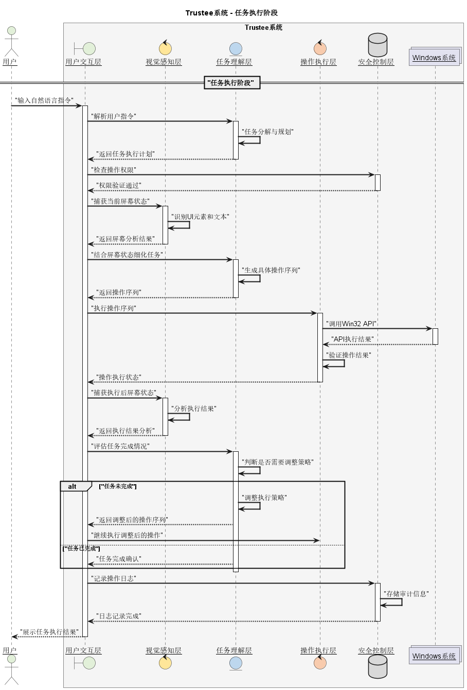
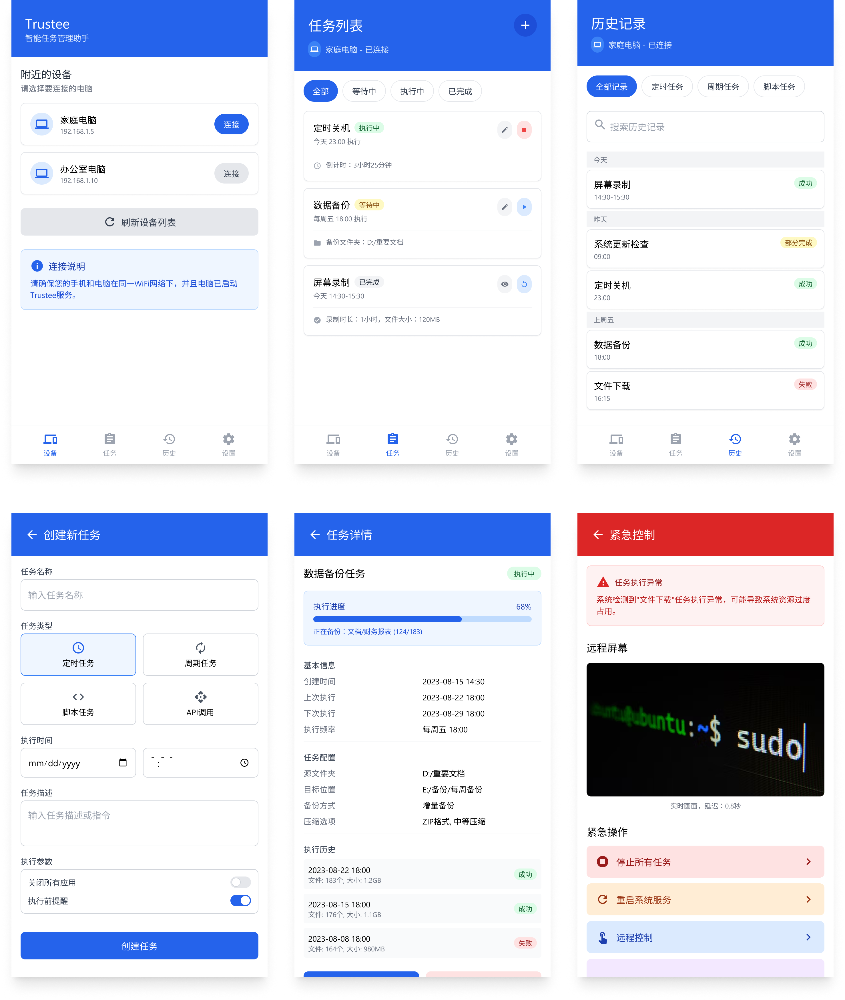

# **可行性分析报告**

## 1 项目概述
### 1.1 项目背景
<p style="text-indent:2em">在数字化转型加速的背景下，企业运营和个人工作效率提升需求持续增长。传统自动化工具存在使用门槛高、部署成本大、灵活性不足等问题，难以满足中小企业和个人用户的即时性需求。本项目旨在构建基于视觉推理模型的系统托管助手，通过自然语言交互和视觉感知技术，将复杂的系统操作转化为"意图即服务"的解决方案，降低自动化技术应用门槛，帮助用户实现电脑端到手机端的任务自动化执行。</p>

### 1.2 基本方案
<p style="text-indent:2em">本系统采用"视觉感知+自然语言理解+系统操作"三位一体的技术架构。通过计算机视觉推理模型识别界面元素，结合大语言模型解析用户意图，最终通过封装Windows API实现自动化操作。支持自然语言指令输入、智能任务分解、跨应用流程编排等功能，提供可视化操作记录和实时反馈机制，形成"感知-决策-执行-验证"的完整闭环。</p>

## 2 市场分析
### 2.1 市场趋势
1. **对自动化需求的增长：** 企业和个人寻求通过自动化提高效率和降低成本。

2. **AI赋能的自动化：** AI 被用于自动优化任务，提高整体效率。

3. **劳动力成本上升：** 自动化可以减少对重复性人工任务的依赖。

4. **云计算技术的发展：** 云计算提供了可扩展且经济高效的托管基础设施。

5. **API 和脚本语言的普及：** 降低了自动化任务的开发和部署难度。

6. **对数据驱动决策的需求：** 自动化数据抓取和分析可以提供有价值的业务洞察。

### 2.2 目标群体
1. **学生：** 利用自动化完成作业、研究、数据分析等任务。预算有限，对价格非常敏感。

2. **数字营销人员：** 利用自动化进行社交媒体营销、SEO 优化等。需要强大的数据分析和报表功能。

3. **内容创作者：** 利用自动化批量生成文章、图片、视频等。需要高质量的内容生成能力。

### 2.3 竞品分析
<p style="text-indent:2em">根据市场上公开信息的调研，我们发现几款较为成功的产品。</p>

1. **AWS：** 提供虚拟机实例 (EC2) 和自动化管理工具 (Systems Manager)，用户可以在 Windows 实例上运行自动化脚本。全球领先的云计算服务提供商，拥有强大的品牌影响力和客户基础。使用门槛较高，配置和管理复杂，价格体系复杂，需要一定的技术知识。

2. **UiPath：** 提供图形化界面，用户可以通过拖拽组件的方式创建自动化流程，模拟人工操作，完成重复性任务。RPA 领域的领导者，拥有强大的品牌影响力和客户基础。价格较高，小型企业以及个体用户。

<p style="text-indent:2em">我们的产品采取的差异化策略：</p>

1. **易用性：** 提供更友好的用户界面和更简单的配置流程。

2. **价格：** 提供更具竞争力的价格。

3. **智能化：** 利用 AI 技术提高自动化任务的智能化水平。

4. **客户友好性：** 针对小型企业和个体用户提升用户体验。

## 3 技术可行性
### 3.1 视觉模型的优势
1. **复杂场景识别：** 采用先进的计算机视觉模型，能够识别和理解屏幕上常见的UI元素、文本内容和图像信息，为AI自动化操作提供感知基础。
在初期阶段，将优先支持标准Windows控件和常见应用程序界面元素。对于复杂或非标准的UI元素，将采用逐步迭代的方式进行支持。
2. **实时处理能力：** 视觉模型具备快速的推理速度，能够实时分析屏幕内容的变化，及时做出响应，确保自动化操作的流畅性和准确性。

### 3.2 Windows API的应用
<p style="text-indent:2em">通过win32 API，我们可以实现对Windows系统的全面控制，包括鼠标移动、点击、键盘输入等操作的模拟。这些API提供了稳定可靠的底层支持，使得AI能够精确地执行各种操作指令。</p>
<p style="text-indent:2em">具体优势包括：</p>

1. **原生API访问：** 直接与Windows系统底层交互，实现高效率的操作控制。通过封装win32 API，实现对Windows系统的操作控制，包括鼠标、键盘模拟等。将针对不同Windows版本进行兼容性测试，确保API调用的稳定性。
2. **UI层次结构感知：** 通过UIA获取完整的界面元素层次关系和属性信息。
3. **无头操作支持：** 支持在无界面环境下运行，适用于自动化场景。

### 3.3 任务推理系统

<p style="text-indent:2em">基于大型语言模型的任务推理系统能够：</p>

1. 理解用户的自然语言指令。
2. 将复杂任务分解为具体的操作步骤。
3. 根据视觉反馈动态调整执行策略。
4. 处理异常情况并进行错误恢复。

### 3.4 Python技术栈

<p style="text-indent:2em">Python作为主要开发语言具有以下优势：</p>

1. 丰富的机器学习和计算机视觉库支持。
2. 完善的Windows系统交互接口。
3. 良好的代码可读性和维护性。
4. 活跃的开源社区和丰富的第三方包资源。
5. 强大的自然语言处理工具支持。
6. 完善的异步编程支持，适合处理复杂的交互场景。

### 3.5 自动化框架设计

<p style="text-indent:2em">项目采用模块化的框架设计，主要包括：</p>

1. **视觉感知模块：** 负责屏幕内容的识别和理解。
2. **操作执行模块：** 实现具体的鼠标键盘操作。
3. **任务规划模块：** 负责任务分解和执行策略生成。
4. **异常处理模块：** 处理各类异常情况和错误恢复。
5. **跨场景协同模块：** 实现GUI、Web和API的统一自动化。

### 3.6 安全性考虑

<p style="text-indent:2em">在系统设计中重点考虑了以下安全因素：</p>

1. **操作权限控制：** 严格限制AI系统的操作范围。
2. **敏感数据保护：** 避免访问用户隐私信息。
3. **操作确认机制：** 重要操作需要用户确认。
4. **应急停止功能：** 用户可随时接管系统控制权。

### 3.7 创新突破点

<p style="text-indent:2em">项目具有以下创新特性：</p>

1. **从脚本到意图的转变：** 用自然语言理解替代固定的点击脚本。
2. **操作系统即API：** 将整个Windows环境视为可编程接口。
3. **自适应界面处理：** 通过LLM适应界面变化，提高系统稳定性。
4. **普适性设计：** 让高级自动化能力通过自然语言触手可及。

## 4 初步设计和开发计划
### 4.1 系统框架设计
<p style="text-indent:2em">我们初步设计系统整体架构与功能模块如下：</p>

1. **系统整体架构**
   - 采用模块化分层设计，确保系统的可扩展性和维护性
   - 核心模块间通过标准接口通信，降低模块间耦合度
   - 采用事件驱动架构，实现模块间的异步通信
   - 支持插件式扩展，便于功能扩展和定制化开发

2. **视觉感知层**
   - 屏幕内容捕获模块：实时获取屏幕图像和界面状态
   - UI元素识别模块：识别和定位界面中的控件和元素
   - 文本识别模块：提取和理解界面中的文本信息

3. **任务理解层**
   - 自然语言处理模块：解析用户指令和意图
   - 任务分解模块：将复杂任务拆分为基本操作序列
   - 上下文管理：维护任务执行的上下文信息
   - 知识库管理：存储和更新常用操作模式

4. **操作执行层**
   - Windows API调用模块：封装系统底层操作接口
   - 操作序列生成：根据任务规划生成具体操作步骤
   - 操作验证模块：验证操作执行的正确性
   - 异常处理机制：处理执行过程中的异常情况

5. **安全控制层**
   - 权限管理模块：控制系统操作权限范围
   - 数据安全模块：保护敏感信息和隐私数据
   - 操作审计模块：记录和分析系统操作日志
   - 应急控制模块：提供紧急停止和人工接管功能

6. **用户交互层**
   - 指令输入接口：支持自然语言和结构化指令输入
   - 状态展示模块：实时显示系统运行状态
   - 操作确认界面：重要操作的用户确认机制
   - 反馈展示模块：提供操作结果和错误提示

7. **开发支持功能**
   - 调试工具集：提供开发和调试所需的工具
   - 日志系统：详细记录系统运行状态
   - 性能监控：监控系统资源使用情况
   - 测试框架：支持自动化测试和性能测试

<p style="text-indent:2em">我们初步设计的系统具有以下特点：</p>

1. **高度模块化**：各功能模块独立封装，便于开发和维护
2. **可扩展性强**：预留扩展接口，支持新功能的灵活添加
3. **安全可控**：多层次的安全保障机制
4. **用户友好**：简单直观的操作界面和自然的交互方式
5. **智能自适应**：能够学习和优化操作策略
6. **稳定可靠**：完善的异常处理和错误恢复机制

<p style="text-indent:2em">我们系统后续的开发重点：</p>

1. 优化视觉模型的识别准确率和速度
2. 增强任务推理系统的理解能力
3. 完善安全控制机制
4. 提升系统整体性能和稳定性
5. 扩展支持更多应用场景

### 4.2 开发计划
<p style="text-indent:2em">本项目具体开发计划如下：</p>

- **需要完成的任务：**
1. 可行性分析报告
2. 需求分析报告
3. 系统架构设计
4. 视觉模型开发
5. 任务推理系统开发
6. 自动化框架开发
7. 系统集成测试
8. 安全性测试
9. 部署方案报告
10. 使用说明书

- **具体时间安排：**

1. **可行性分析报告（3月7日-3月11日）**
   - 技术调研和资料收集：3月7日-3月9日
   - 报告撰写和评审：3月9日-3月11日
   - 交付物：可行性分析报告

2. **需求分析报告（3月11日-3月15日）**
   - 用户需求调研：3月11日-3月13日
   - 需求分析和文档编写：3月13日-3月15日
   - 交付物：需求规格说明书

3. **系统架构设计（3月15日-3月22日）**
   - 整体架构设计：3月15日-3月18日
   - 模块接口设计：3月18日-3月20日
   - 技术方案评审：3月20日-3月22日
   - 交付物：架构设计文档

4. **视觉推理模型探究（3月22日-4月12日）**
   - 数据收集和预处理：3月22日-3月29日
   - 模型训练和优化：3月29日-4月5日
   - 模型评估和改进：4月5日-4月12日
   - 交付物：视觉识别模型框架

5. **任务推理系统开发（3月22日-4月12日）**
   - LLM接口开发：3月22日-3月29日
   - 推理策略实现：3月29日-4月5日
   - 系统优化和测试：4月5日-4月12日
   - 交付物：任务推理引擎

6. **自动化框架开发（4月12日-5月3日）**
   - Windows API封装：4月12日-4月19日
   - 操作执行模块：4月19日-4月26日
   - 异常处理机制：4月26日-5月3日
   - 交付物：自动化执行框架

7. **系统集成测试（5月3日-5月17日）**
   - 模块集成：5月3日-5月10日
   - 功能测试：5月10日-5月14日
   - 性能测试：5月14日-5月17日
   - 交付物：测试报告

8. **安全性测试（5月17日-5月31日）**
   - 安全机制实现：5月17日-5月24日
   - 渗透测试：5月24日-5月28日
   - 安全评估：5月28日-5月31日
   - 交付物：安全测试报告

9. **部署方案和文档（5月31日-6月7日）**
   - 部署方案设计：5月31日-6月3日
   - 使用文档编写：6月3日-6月7日
   - 交付物：部署方案和用户手册

- **项目里程碑：**
1. **M1**：3月15日 - 完成项目立项和需求分析
2. **M2**：3月22日 - 完成系统架构设计
3. **M3**：4月12日 - 完成核心模块开发
4. **M4**：5月3日 - 完成自动化框架
5. **M5**：5月31日 - 完成系统测试
6. **M6**：6月7日 - 项目交付

<p style="text-indent:2em">具体时间可根据开发速度视情况进行调整。</p>

## 5 成本估算
### 5.1 研发成本
1. 软件设计：确定平台的功能、架构、用户界面等，约100元。
2. 编程开发：实现平台的核心功能，例如任务调度、资源管理、安全认证等，约100元。

### 5.2 运营成本
1. 云服务器：用于部署平台和后端服务实现，预计数量为1台，规格为4核8G，约5000元/年。
2. 数据库: 用于存储用户数据、日志等，预计约2000元/年。
3. 网络流量: 用于用户访问平台和传输数据，预计约500元/年。

### 5.3 知识产权成本
1. 域名注册: 注册和购买平台域名，预计约100元/年。
2. 商标注册: 注册平台商标，预计约2000元。
3. 软件著作权登记: 对软件进行著作权登记，预计约3000元。

### 5.4 市场营销成本
1. 广告费用: 在社交媒体、搜索引擎等平台投放广告，预计约10000元/年。
2. 内容营销费用: 创作和推广内容，例如博客、视频教程等，预计约10000元/年。
3. 活动费用: 举办线上或线下活动，吸引用户，预计约10000元/年。

### 5.5 其他成本
1. 办公场地租金：租用办公场地，不计入考虑。
2. 办公用品费用: 购买办公用品，不计入考虑。

## 6 法律和合规性
<p style="text-indent:2em">本项目严格遵守相关法律法规，主要合规措施包括：</p>

1. **数据隐私保护**：符合GDPR和《个人信息保护法》要求，采用数据最小化原则，用户操作数据本地化存储，建立数据访问审计机制。
2. **知识产权合规**：通过自有模型训练避免侵权风险，操作脚本库采用开源协议管理。
3. **平台服务条款**：建立自动化任务审核机制，禁止爬虫、批量注册等违规操作。
4. **用户协议规范**：明确责任边界，建立操作授权确认和风险提示机制。
5. **网络安全保障**：通过等保2.0基础要求，实现操作日志可追溯、系统权限最小化。

## 7 开发团队
<p style="text-indent:2em">我们开发团队共有三名成员，具体成员和分工名单详见表1。</p>

| 姓名  |   职责    |        分工        |
|:---:|:-------:|:----------------:|
| 姜涛  |  项目组长   | 视觉感知设计与合规统筹，代码实现 |
| 叶子洲 |   负责人   | 执行引擎与系统安全设计，代码实现 |
| 秦雨芊 |   负责人   | UI界面与接口开发设计，代码实现 |

<p align="center">表1 示例表格</p>

## 8 风险评估
1. 技术风险：平台在高并发、大数据量情况下可能出现崩溃、卡顿等问题。用户数据可能被泄露、篡改或丢失。平台依赖的第三方服务出现故障或停止服务。
2. 市场风险：市场上出现更具竞争力的产品，导致用户流失。出现新的技术或趋势，导致平台落后于时代。政府出台新的政策法规，限制或禁止自动化任务托管平台的使用。
3. 运营风险：用户对平台满意程度不足。营销活动未能有效吸引用户，导致用户增长缓慢。客户服务未能及时解决用户问题，导致用户体验下降。运营成本过高，导致盈利困难。
4. 伦理风险：用户利用平台进行恶意行为，例如刷单、网络攻击、传播虚假信息等。
5. 法律风险：用户滥用平台进行非法活动，导致平台承担法律责任。平台收集、存储或使用用户数据违反了数据隐私法规。

## 9 总结
<p style="text-indent:2em">经过全面可行性分析，本项目在技术实现、市场需求、成本控制等方面均具备实施条件。核心技术方案通过视觉感知与语言模型的融合创新，有效解决了传统自动化工具灵活性不足的问题。差异化定价策略和精准的目标用户定位，使产品在竞争激烈的市场中具有独特优势。尽管存在技术实现复杂度高、市场竞争激烈等风险，但通过模块化开发策略和持续迭代的运营模式，能够有效控制项目风险。</p>

---

# **需求分析报告**

## 1 引言
<p style="text-indent:2em">随着远程办公和混合办公模式的普及，企业和个人对提高工作效率的需求日益增长。特别是在疫情加速了远程办公普及的背景下，人们需要一种能够安全、高效地访问Windows应用程序和数据的解决方案。同时，劳动力成本的上升推动了对自动化解决方案的需求，以减少对重复性人工任务的依赖。Trustee项目旨在提供一个智能化的Windows系统托管和自动化平台，通过先进的视觉模型和任务推理系统，帮助用户实现工作流程的自动化，提高工作效率，并满足远程办公环境下的各种需求。</p>

## 2 项目范围
### 2.1 系统类型
<p style="text-indent:2em">基于可行性分析报告，我们定位项目为Windows系统托管和自动化平台，主要面向远程办公和自动化任务管理。</p>

### 2.2 支持平台
<p style="text-indent:2em">Windows系统</p>

### 2.3 特色与功能
1. 使用先进的视觉模型技术，能够识别和理解屏幕上的UI元素
2. 基于大型语言模型的任务推理系统，能够理解用户的自然语言指令
3. 提供统一的自动化框架，实现GUI、Web和API的一体化自动化
4. 强大的安全控制机制，确保用户数据安全
5. 友好的用户界面，降低使用门槛

## 3 用户需求

### 3.1 目标受众群体
<p style="text-indent:2em">根据可行性分析报告与市场调研，我们将平台的目标用户群体定位为：</p>

1. **企业用户**：需要支持员工远程办公的企业，特别是采用混合办公模式的组织。这些企业需要安全可靠的方式让员工访问企业应用程序和数据。

2. **自动化需求用户**：寻求提高工作效率的企业和个人，希望通过自动化减少重复性任务。

3. **学生群体**：利用自动化完成作业、研究、数据分析等任务，预算有限，对价格非常敏感。

4. **数字营销人员**：利用自动化进行社交媒体营销、SEO优化等，需要强大的数据分析和报表功能。

5. **内容创作者**：利用自动化批量生成文章、图片、视频等，需要高质量的内容生成能力。

### 3.2 用户共同需求特点

<p style="text-indent:2em">从市场调研中，我们发现目标用户群体有以下共同需求特点：</p>

1. 对提高工作效率的强烈需求
2. 希望减少重复性劳动，将时间用于更有价值的工作
3. 对系统易用性的高度重视，希望能够快速上手
4. 对数据安全和隐私保护的关注
5. 对系统稳定性和可靠性的要求

### 3.3 不同用户群体的差异化需求

1. **企业用户**：
   - 更关注安全性和合规性
   - 需要集中管理和控制功能
   - 对系统集成能力有较高要求
   - 对成本控制和ROI有明确预期

2. **个人用户**：
   - 更关注使用便捷性
   - 对价格敏感度高
   - 希望有个性化的配置选项
   - 对技术支持响应速度要求高

3. **学生群体**：
   - 预算有限，需要经济实惠的解决方案
   - 学习曲线较短，能够快速掌握
   - 满足学习和研究的特定需求

4. **数字营销人员**：
   - 需要与各种社交媒体平台和营销工具集成
   - 对数据分析和可视化功能有较高要求
   - 希望能够批量处理营销任务

5. **内容创作者**：
   - 需要高质量的内容生成功能
   - 与创意工具的良好集成
   - 对输出内容的质量和原创性有较高要求

## 4 功能需求
<p style="text-indent:2em">本项目的任务执行阶段见图1展示：</p>
<center class ='img'>

</center>
<p align="center">图1 Trustee任务执行阶段</p>

### 4.1 系统框架功能

1. **视觉感知层**：
   - 屏幕内容捕获功能：实时获取屏幕图像和界面状态
   - UI元素识别功能：识别和定位界面中的控件和元素
   - 文本识别功能：提取和理解界面中的文本信息

2. **任务理解层**：
   - 自然语言处理功能：解析用户指令和意图
   - 任务分解功能：将复杂任务拆分为基本操作序列
   - 上下文管理：维护任务执行的上下文信息
   - 知识库管理：存储和更新常用操作模式

3. **操作执行层**：
   - Windows API调用功能：封装系统底层操作接口
   - 操作序列生成：根据任务规划生成具体操作步骤
   - 操作验证功能：验证操作执行的正确性
   - 异常处理机制：处理执行过程中的异常情况

### 4.2 安全控制功能

1. **权限管理功能**：
   - 控制系统操作权限范围
   - 差异化权限设置
   - 权限审计功能

2. **数据安全功能**：
   - 敏感信息保护
   - 数据加密存储
   - 隐私数据管理

3. **操作审计功能**：
   - 记录系统操作日志
   - 操作行为分析
   - 异常行为检测

4. **应急控制功能**：
   - 紧急停止机制
   - 人工接管功能
   - 回滚操作能力

### 4.3 用户交互功能

1. **指令输入功能**：
   - 支持自然语言指令
   - 结构化指令输入
   - 语音指令识别

2. **状态展示功能**：
   - 实时显示系统运行状态
   - 任务执行进度展示
   - 资源使用情况监控

3. **操作确认功能**：
   - 重要操作的用户确认机制
   - 操作风险提示
   - 操作预览功能

4. **反馈展示功能**：
   - 操作结果反馈
   - 错误提示和建议
   - 优化建议推送

<p style="text-indent:2em">具体的手机端网页原型设计如图2所示：</p>

<p align="center">图2 Trustee原型设计图</p>

### 4.4 自动化任务功能

1. **任务编排功能**：
   - 视觉化任务设计
   - 任务模板管理
   - 条件分支和循环控制

2. **定时调度功能**：
   - 任务定时执行
   - 周期性任务设置
   - 条件触发执行

3. **数据处理功能**：
   - 数据采集和提取
   - 数据转换和处理
   - 数据导出和分析

### 4.5 其他需求

1. 多平台支持，允许从不同设备访问和控制
2. 用户习惯学习和适应能力
3. 系统扩展接口，支持与第三方应用集成
4. 完善的用户文档和培训资料

## 5 性能需求

### 5.1 系统性能
1. 视觉模型的识别准确率应达到95%以上
2. 任务推理系统的响应时间应在数秒内
3. 系统应能同时处理多个自动化任务，不影响整体性能
4. 系统资源占用应在合理范围内，不影响用户其他应用使用

### 5.2 网络性能
1. 系统应适应不同网络环境，包括低带宽和高延迟情况
2. 远程访问时延应控制在可接受范围内
3. 数据传输应采用高效压缩算法，减少带宽占用
4. 应具备断网重连和数据同步机制

## 6 数据管理
### 6.1 用户相关
<p style="text-indent:2em">由于系统涉及到用户的登录以及自动化任务管理，需要记录用户的用户名、用户ID、密码、权限级别、自动化任务配置等信息。这些将通过一个部署在服务器上的数据库进行管理。</p>

### 6.2 系统数据
<p style="text-indent:2em">系统运行中会产生大量数据，包括任务执行记录、性能监控数据、错误日志、用户操作日志等。这些数据需要通过结构化的方式进行存储和管理，既方便系统运行分析，也便于问题排查。</p>

## 7 接口需求

1. 用户接口：提供Web界面和本地客户端两种接入方式
2. 编程接口：提供API接口，允许开发者进行二次开发和集成
3. 服务接口：支持与其他系统和服务的对接和数据交换
4. 硬件接口：适配不同的输入设备和显示设备

## 8 约束

1. 系统需在Windows环境下运行，至少支持Windows 10及以上版本
2. 需遵守相关法律法规，特别是数据隐私和信息安全相关规定
3. 系统开发和部署成本需控制在预算范围内
4. 系统应适应不同屏幕分辨率和显示设置

## 9 逆向需求

1. 系统不应过分干扰用户的正常操作
2. 系统不应在未经授权的情况下访问敏感数据
3. 系统不应在无用户确认的情况下执行高风险操作
4. 系统不应过度消耗系统资源，影响整体性能

## 10 可靠性和可用性需求
### 10.1 可靠性需求

1. **系统稳定性**：系统需具备高度稳定性，在长时间运行后不出现内存泄漏、性能下降等问题。系统应能自动监测并恢复各种故障状态，确保服务的连续性。

2. **数据一致性**：确保用户的任务配置、执行记录等数据在任何时间都能被正确保存和同步。特别是在网络波动或系统意外关闭情况下，能够恢复到一致的状态。

3. **错误恢复机制**：实现全面的错误恢复机制，包括自动重连、数据备份与恢复、用户友好的错误提示等，确保在各种异常情况下能够平稳恢复。

4. **防误操作机制**：实施有效的防误操作措施，特别是对于潜在危险的操作，应提供确认机制和回滚能力，避免造成不可挽回的损失。

### 10.2 可用性需求

1. **用户界面友好性**：设计直观易用的用户界面，使各类用户能够快速上手。界面应清晰展示系统状态和任务执行情况，提供必要的反馈。

2. **适应性设计**：系统应适应各种设备和屏幕尺寸，提供一致的用户体验。对于不同的用户角色和使用场景，应提供相应的优化。

3. **可访问性考虑**：系统设计应考虑到不同用户的特殊需求，包括视觉障碍辅助、键盘操作优化等可访问性功能，以便更广泛的用户群体能够使用。

4. **操作简便性**：复杂的自动化任务应可通过简单的步骤配置和管理，降低用户的学习成本和操作负担。

5. **反馈机制**：系统应提供清晰的操作反馈和状态提示，帮助用户了解当前任务的执行情况，增强用户信心。

## 11 出错处理需求
### 11.1 操作错误
<p style="text-indent:2em">当用户进行错误操作或系统检测到潜在风险操作时，系统应能及时提示并阻止，必要时提供修正建议。对于已执行的错误操作，系统应提供撤销或回滚机制，将影响降至最低。</p>

### 11.2 网络错误
<p style="text-indent:2em">当系统遇到网络连接中断或不稳定时，应能暂存数据，并在网络恢复后自动重新连接和同步。系统应具备离线工作能力，确保在网络环境不理想的情况下仍能完成关键功能。</p>

### 11.3 系统崩溃
<p style="text-indent:2em">在系统崩溃或异常退出情况下，应能保护用户数据不丢失，并在重启后恢复到上一个稳定状态。系统应记录崩溃前的详细日志，便于问题诊断和修复。</p>

---

# **原型设计报告**

## 1 引言

<p style="text-indent:2em">本文档旨在详细描述Trustee系统的原型设计方案，包括用户界面设计、交互流程设计、系统架构原型以及核心功能模块的设计思路。通过原型设计，验证系统可行性并为后续详细设计和开发提供指导。本文档涵盖Trustee系统的前端用户界面原型、后端API接口设计、数据库结构设计、AI服务集成方案以及系统整体架构原型。</p>

<p style="text-indent:2em">本文档面向项目开发团队、系统架构师、UI/UX设计师以及项目管理人员。</p>

## 2 设计概述

### 2.1 设计理念
<p style="text-indent:2em">Trustee系统的设计遵循"简单易用、智能高效、安全可靠"的核心理念。通过Material Design设计语言，打造现代化、用户友好的交互界面；通过模块化架构设计，实现系统的高可扩展性和可维护性。</p>

### 2.2 技术选型
<p style="text-indent:2em">前端采用原生HTML5/CSS3/JavaScript技术栈，确保轻量化和良好的兼容性；后端采用Flask框架，提供RESTful API服务；数据存储使用SQLite数据库，支持嵌入式部署；AI服务集成阿里云百炼API，提供强大的视觉理解和自然语言处理能力。</p>

## 3 系统架构原型

### 3.1 整体架构设计
<p style="text-indent:2em">系统采用分层架构设计，包括用户交互层、视觉感知层、任务理解层、操作执行层和安全控制层。各层之间通过标准接口进行通信，确保系统的松耦合和高内聚。</p>

<center class ='img'>

</center>
<p align="center">图1 Trustee系统架构图</p>

### 3.2 核心组件设计

#### 3.2.1 前端层 (Frontend)
- **技术栈**: HTML5 + CSS3 + JavaScript
- **设计风格**: Material Design
- **响应式设计**: 支持桌面和移动设备
- **主要页面**: 登录页面、设备管理、任务管理、AI工作室、历史记录

#### 3.2.2 后端服务层 (Backend)
- **Web框架**: Flask 2.3+
- **API设计**: RESTful风格
- **认证机制**: Session based authentication
- **核心服务**: 用户认证、设备管理、任务管理、AI自动化

#### 3.2.3 数据存储层 (Database)
- **数据库**: SQLite 3
- **ORM方案**: 自定义DAO模式
- **核心数据表**: 用户表、设备表、任务表、执行记录表等7个核心表

#### 3.2.4 AI服务层 (AI Services)
- **AI模型**: 阿里云百炼 doubao-1.5-ui-tars
- **核心功能**: 图像理解、指令解析、代码生成
- **服务封装**: AIAutomationService 类

## 4 用户界面原型设计

### 4.1 界面设计原则
1. **一致性**: 统一的视觉风格和交互模式
2. **易用性**: 简洁直观的操作流程
3. **响应性**: 快速的交互反馈
4. **可访问性**: 支持不同用户群体的使用需求

### 4.2 主要界面原型

#### 4.2.1 登录界面
<p style="text-indent:2em">采用简洁的卡片式设计，包含用户名密码输入框、登录按钮和注册链接。背景使用渐变色设计，提升视觉效果。</p>

<center class ='img'>
<!-- 登录界面原型图占位 -->

</center>
<p align="center">图2 登录界面原型</p>

#### 4.2.2 设备管理界面
<p style="text-indent:2em">采用卡片网格布局，展示设备列表。每个设备卡片包含设备名称、状态指示器、基本信息和操作按钮。支持设备的添加、编辑、删除和连接测试功能。</p>

<center class ='img'>
<!-- 设备管理界面原型图占位 -->

</center>
<p align="center">图3 设备管理界面原型</p>

#### 4.2.3 任务管理界面
<p style="text-indent:2em">采用列表卡片布局，展示任务列表和详细信息。包含任务状态筛选、进度条显示、操作按钮等功能。支持任务的创建、编辑、执行和删除。</p>

<center class ='img'>
<!-- 任务管理界面原型图占位 -->

</center>
<p align="center">图4 任务管理界面原型</p>

#### 4.2.4 AI工作室界面
<p style="text-indent:2em">采用双栏布局，左侧为截图上传和指令输入区域，右侧为分析结果展示区域。包含动态滚轮效果、代码生成展示、可视化标注等功能。</p>

<center class ='img'>
<!-- AI工作室界面原型图占位 -->

</center>
<p align="center">图5 AI工作室界面原型</p>

## 5 交互流程设计

### 5.1 用户登录流程
<p style="text-indent:2em">用户访问系统时，如果未登录则自动跳转到登录页面。输入用户名密码后，系统验证用户信息并创建Session。登录成功后跳转到主界面。</p>

<center class ='img'>
<!-- 用户登录流程图占位 -->

</center>
<p align="center">图6 用户登录交互流程</p>

### 5.2 任务创建执行流程
<p style="text-indent:2em">用户在任务管理页面创建新任务，输入任务名称和自然语言指令。系统调用AI服务分析指令，生成任务步骤。用户可以选择立即执行或稍后执行。</p>

<center class ='img'>
<!-- 任务执行流程图占位 -->

</center>
<p align="center">图7 任务创建执行交互流程</p>

### 5.3 AI分析交互流程
<p style="text-indent:2em">用户在AI工作室上传截图并输入操作指令，系统调用AI服务进行图像分析和指令解析，返回分析结果和生成的操作代码。用户可以选择演练模式预览或直接执行操作。</p>

<center class ='img'>
<!-- AI分析流程图占位 -->

</center>
<p align="center">图8 AI分析交互流程</p>

## 6 数据模型原型

### 6.1 核心数据实体
<p style="text-indent:2em">系统包含7个核心数据实体：用户(User)、设备(Device)、任务(Task)、任务步骤(TaskStep)、截图(Screenshot)、AI分析(AIAnalysis)、执行记录(Execution)。</p>

### 6.2 实体关系设计
<p style="text-indent:2em">数据实体间的关系如下：</p>
- 用户与设备：一对多关系
- 用户与任务：一对多关系  
- 任务与任务步骤：一对多关系
- 任务步骤与截图：一对一关系
- 截图与AI分析：一对一关系
- AI分析与执行记录：一对一关系

<center class ='img'>
<!-- 数据模型ER图占位 -->

</center>
<p align="center">图9 数据模型实体关系图</p>

## 7 API接口原型

### 7.1 接口设计原则
<p style="text-indent:2em">API接口遵循RESTful设计原则，使用HTTP标准方法(GET、POST、PUT、DELETE)，统一的JSON响应格式，完善的错误处理机制。</p>

### 7.2 核心API接口

​	核心API接口包括用户认证接口、设备管理接口和AI分析接口。

## 8 技术实现原型

### 8.1 前端实现方案
<p style="text-indent:2em">前端使用原生JavaScript实现，通过Fetch API与后端通信，使用CSS Grid和Flexbox实现响应式布局，通过事件驱动机制实现用户交互。</p>

### 8.2 后端实现方案
<p style="text-indent:2em">后端基于Flask框架构建，使用自定义DAO模式进行数据访问，通过装饰器实现权限验证，集成AI服务实现智能分析功能。</p>

### 8.3 AI服务集成方案
<p style="text-indent:2em">通过AIAutomationService类封装AI服务调用，支持图像分析、指令解析和代码生成功能。使用异步处理提升响应性能，实现操作执行的演练和实际执行模式。</p>

## 9 安全性设计

### 9.1 认证授权机制
<p style="text-indent:2em">系统采用基于Session的认证机制，通过装饰器实现API级别的权限控制，确保只有授权用户才能访问相应功能。</p>

### 9.2 数据安全保护
<p style="text-indent:2em">敏感数据采用加密存储，用户密码使用哈希算法处理，数据库访问通过参数化查询防止SQL注入攻击。</p>

### 9.3 操作安全控制
<p style="text-indent:2em">自动化操作提供演练模式，重要操作需要用户确认，系统提供紧急停止机制，记录详细的操作日志供审计。</p>

## 10 性能设计

### 10.1 响应时间要求
- 页面加载时间 < 1秒
- API接口响应时间 < 500ms（除AI分析外）
- AI分析响应时间 < 5秒
- 任务执行反馈实时性 < 100ms

### 10.2 并发处理能力
<p style="text-indent:2em">系统支持多用户并发访问，单实例支持100个并发用户，通过连接池优化数据库性能，使用异步处理提升并发能力。</p>

### 10.3 资源占用控制
<p style="text-indent:2em">系统内存占用控制在100MB以内，数据库文件大小动态增长，支持定期清理历史数据，确保长期运行稳定性。</p>

## 11 可扩展性设计

### 11.1 模块化架构
<p style="text-indent:2em">系统采用模块化设计，各功能模块独立封装，通过标准接口通信，便于功能扩展和维护。</p>

### 11.2 插件化支持
<p style="text-indent:2em">预留插件接口，支持第三方功能模块的集成，允许用户根据需要扩展系统功能。</p>

### 11.3 多平台适配
<p style="text-indent:2em">设计支持多操作系统平台，预留移动端适配接口，支持云端部署和本地部署两种模式。</p>

## 12 测试原型设计

### 12.1 测试策略
<p style="text-indent:2em">采用分层测试策略，包括单元测试、集成测试、系统测试和用户验收测试。每个测试阶段都有明确的测试目标和验收标准。</p>

### 12.2 测试用例设计
<p style="text-indent:2em">基于功能需求设计测试用例，包括正常场景测试、异常场景测试、边界条件测试和性能测试。</p>

### 12.3 自动化测试
<p style="text-indent:2em">开发自动化测试脚本，覆盖核心功能流程，确保系统变更后的回归测试效率。</p>

## 13 部署原型设计

### 13.1 部署环境要求
- **操作系统**: Windows 10/11 (推荐)
- **Python版本**: 3.8+
- **内存要求**: 2GB+
- **磁盘空间**: 100MB+
- **网络环境**: 支持外网访问（AI服务）

### 13.2 部署配置
<p style="text-indent:2em">系统支持一键部署，通过配置文件管理系统参数，支持开发环境和生产环境的配置切换。</p>

### 13.3 运维监控
<p style="text-indent:2em">集成日志系统，支持系统运行状态监控，提供性能指标统计和异常告警功能。</p>

## 14 结论

### 14.1 原型验证结果
<p style="text-indent:2em">通过原型设计验证，Trustee系统的技术架构合理，功能设计完整，用户界面友好，具备良好的可扩展性和维护性。</p>

### 14.2 后续开发建议
<p style="text-indent:2em">建议在详细设计阶段进一步优化数据库性能，完善错误处理机制，增强系统安全性，并根据用户反馈持续改进用户体验。</p>

### 14.3 项目展望
<p style="text-indent:2em">基于当前原型设计，系统具备了向智能化、自动化、平台化发展的基础，为未来的功能扩展和商业化运营奠定了坚实基础。</p> 

---

# **系统设计报告**

## 1 引言

### 1.1 编写目的
<p style="text-indent:2em">本文档详细描述Trustee系统的详细设计方案，包括系统架构、模块设计、数据库设计、接口设计和算法设计等内容。为开发人员提供实现系统的详细技术指导，确保系统开发的规范性和一致性。</p>

### 1.2 文档范围
<p style="text-indent:2em">本文档涵盖Trustee系统的详细技术设计，包括系统总体架构、各功能模块的详细设计、数据库表结构设计、API接口设计、安全设计和性能优化方案。</p>

### 1.3 预期读者
<p style="text-indent:2em">本文档主要面向系统开发人员、系统架构师、测试工程师和运维人员。</p>

## 2 系统总体设计

### 2.1 系统架构设计
<p style="text-indent:2em">Trustee系统采用经典的分层架构模式，从上到下分为用户交互层、视觉感知层、任务理解层、操作执行层和安全控制层。通过清晰的分层设计，实现系统的高内聚、低耦合，提高系统的可维护性和可扩展性。</p>

<center class ='img'>
<!-- 系统架构层次图占位 -->

</center>
<p align="center">图1 Trustee系统分层架构图</p>

### 2.2 技术架构选型

#### 2.2.1 前端技术栈
- **HTML5**: 提供语义化标记和现代Web标准支持
- **CSS3**: 实现响应式布局和现代化视觉效果
- **JavaScript ES6+**: 提供客户端交互逻辑和异步通信
- **Material Icons**: 统一的图标系统

#### 2.2.2 后端技术栈
- **Python 3.8+**: 主要开发语言
- **Flask 2.3+**: 轻量级Web框架
- **SQLite 3**: 嵌入式数据库
- **PyAutoGUI**: 自动化操作库
- **Pillow**: 图像处理库

#### 2.2.3 AI服务集成
- **阿里云百炼API**: 提供多模态大语言模型服务
- **doubao-1.5-ui-tars**: 专门优化的UI理解模型

### 2.3 部署架构设计
<p style="text-indent:2em">系统支持单机部署和分布式部署两种模式。单机部署适用于个人用户和小型团队；分布式部署支持负载均衡和高可用性，适用于企业级应用。</p>

<center class ='img'>
<!-- 部署架构图占位 -->

</center>
<p align="center">图2 系统部署架构图</p>

## 3 详细模块设计

### 3.1 用户认证模块

#### 3.1.1 模块功能描述
<p style="text-indent:2em">用户认证模块负责用户的注册、登录、权限验证和会话管理。采用基于Session的认证机制，支持用户权限分级管理。</p>

#### 3.1.2 主要类设计

```python
class UserDAO:
    """用户数据访问对象"""
    
    @staticmethod
    def create_user(user: User) -> bool:
        """创建用户"""
        pass
    
    @staticmethod
    def get_by_username(username: str) -> Optional[User]:
        """根据用户名获取用户"""
        pass
    
    @staticmethod
    def authenticate(username: str, password: str) -> Optional[User]:
        """用户认证"""
        pass
```

#### 3.1.3 认证流程设计
<p style="text-indent:2em">用户访问系统时，首先检查Session中是否存在有效的用户信息。如果不存在，则重定向到登录页面。登录成功后，在Session中存储用户信息，并设置适当的过期时间。</p>

### 3.2 设备管理模块

#### 3.2.1 模块功能描述
<p style="text-indent:2em">设备管理模块负责管理用户的设备信息，包括设备注册、状态监控、连接测试和远程控制功能。支持本地设备和远程设备的统一管理。</p>

#### 3.2.2 核心类设计

```python
class DeviceDAO:
    """设备数据访问对象"""
    
    @staticmethod
    def create(device: Device) -> int:
        """创建设备"""
        pass
    
    @staticmethod
    def get_by_user_id(user_id: int) -> List[Device]:
        """获取用户的所有设备"""
        pass
    
    @staticmethod
    def update_status(device_id: int, status: str) -> bool:
        """更新设备状态"""
        pass
```

#### 3.2.3 连接测试机制
<p style="text-indent:2em">设备连接测试通过ping命令验证网络连通性，同时支持HTTP健康检查接口验证服务可用性。测试结果实时更新设备状态。</p>

### 3.3 任务管理模块

#### 3.3.1 任务生命周期管理
<p style="text-indent:2em">任务管理模块支持完整的任务生命周期管理，包括任务创建、执行调度、状态监控、结果收集和历史记录。</p>

<center class ='img'>
<!-- 任务生命周期图占位 -->

</center>
<p align="center">图4 任务生命周期图</p>

#### 3.3.2 任务执行引擎设计

```python
class WorkflowService:
    """工作流服务"""
    
    def execute_task(self, task_id: int) -> bool:
        """执行任务"""
        pass
    
    def create_task_steps(self, task: Task) -> List[TaskStep]:
        """创建任务步骤"""
        pass
    
    def monitor_execution(self, task_id: int) -> Dict[str, Any]:
        """监控任务执行"""
        pass
```

### 3.4 AI自动化模块

#### 3.4.1 AI服务架构
<p style="text-indent:2em">AI自动化模块是系统的核心组件，整合了图像识别、自然语言处理和操作执行功能。通过AIAutomationService类提供统一的服务接口。</p>

#### 3.4.2 坐标转换算法
```python
def scale_coordinates_to_absolute(relative_coords: tuple, original_size: tuple, 
                                target_resolution: str = "auto") -> tuple:
    """坐标缩放转换算法"""
    if target_resolution == "auto":
        target_width, target_height = pyautogui.size()
    else:
        target_width, target_height = map(int, target_resolution.split('x'))
    
    orig_width, orig_height = original_size
    scale_x = target_width / orig_width
    scale_y = target_height / orig_height
    
    abs_x = int(relative_coords[0] * scale_x)
    abs_y = int(relative_coords[1] * scale_y)
    
    return (abs_x, abs_y)
```

### 3.5 数据访问模块

#### 3.5.1 DAO模式设计
<p style="text-indent:2em">系统采用数据访问对象(DAO)模式，为每个数据实体提供独立的数据访问类。所有DAO类继承自BaseDAO，提供统一的数据操作接口。</p>

```python
class BaseDAO:
    """基础DAO类"""
    
    @staticmethod
    def row_to_dict(row: sqlite3.Row) -> Dict[str, Any]:
        """将数据库行转换为字典"""
        return dict(row) if row else {}
    
    @staticmethod
    def execute_query(sql: str, params: tuple = ()) -> List[sqlite3.Row]:
        """执行查询SQL"""
        pass
    
    @staticmethod
    def execute_update(sql: str, params: tuple = ()) -> int:
        """执行更新SQL"""
        pass
```

#### 3.5.2 数据库连接管理
<p style="text-indent:2em">采用数据库管理器模式，统一管理数据库连接的创建、使用和释放。支持连接池优化和事务管理。</p>

## 4 数据库详细设计

### 4.1 数据库概述
<p style="text-indent:2em">系统使用SQLite作为数据存储方案，包含7个核心数据表，支持完整的业务数据管理。数据库设计遵循第三范式，确保数据的一致性和完整性。</p>

### 4.2 数据表详细设计

#### 4.2.1 用户表 (users)
<p style="text-indent:2em">存储用户基本信息和权限设置。</p>

```sql
CREATE TABLE users (
    user_id INTEGER PRIMARY KEY AUTOINCREMENT,
    username TEXT UNIQUE NOT NULL,
    email TEXT,
    password_hash TEXT NOT NULL,
    permission_level INTEGER DEFAULT 1,
    created_at TIMESTAMP DEFAULT CURRENT_TIMESTAMP,
    last_login TIMESTAMP,
    is_active BOOLEAN DEFAULT 1,
    preferences_json TEXT
);
```

#### 4.2.2 设备表 (devices)
<p style="text-indent:2em">记录用户管理的设备信息和状态。</p>

```sql
CREATE TABLE devices (
    device_id INTEGER PRIMARY KEY AUTOINCREMENT,
    device_name TEXT NOT NULL,
    device_ip TEXT,
    device_type TEXT DEFAULT 'local',
    os_info TEXT,
    screen_resolution TEXT,
    last_online TIMESTAMP,
    status TEXT DEFAULT 'offline',
    owner_user_id INTEGER NOT NULL,
    created_at TIMESTAMP DEFAULT CURRENT_TIMESTAMP,
    last_updated TIMESTAMP DEFAULT CURRENT_TIMESTAMP,
    FOREIGN KEY (owner_user_id) REFERENCES users (user_id)
);
```

#### 4.2.3 任务表 (tasks)
<p style="text-indent:2em">存储任务的基本信息和执行状态。</p>

```sql
CREATE TABLE tasks (
    task_id INTEGER PRIMARY KEY AUTOINCREMENT,
    user_id INTEGER NOT NULL,
    device_id INTEGER,
    task_name TEXT NOT NULL,
    task_description TEXT,
    task_type TEXT DEFAULT 'manual',
    natural_language_input TEXT,
    status TEXT DEFAULT 'pending',
    priority INTEGER DEFAULT 0,
    created_at TIMESTAMP DEFAULT CURRENT_TIMESTAMP,
    started_at TIMESTAMP,
    completed_at TIMESTAMP,
    last_updated TIMESTAMP DEFAULT CURRENT_TIMESTAMP,
    total_steps INTEGER DEFAULT 0,
    completed_steps INTEGER DEFAULT 0,
    error_message TEXT,
    config_json TEXT,
    estimated_duration TEXT,
    actual_duration TEXT,
    FOREIGN KEY (user_id) REFERENCES users (user_id),
    FOREIGN KEY (device_id) REFERENCES devices (device_id)
);
```

### 4.3 数据关系设计

<center class ='img'>
<!-- 数据库ER图占位 -->

</center>
<p align="center">图6 数据库实体关系图</p>

### 4.4 索引设计
<p style="text-indent:2em">为提高查询性能，系统在关键字段上创建了索引：</p>

```sql
-- 用户任务状态查询优化
CREATE INDEX idx_tasks_user_status ON tasks(user_id, status);
-- 任务创建时间查询优化
CREATE INDEX idx_tasks_created_at ON tasks(created_at);
-- 任务步骤顺序查询优化
CREATE INDEX idx_steps_task_sequence ON task_steps(task_id, step_sequence);
```

## 5 接口详细设计

### 5.1 API设计原则
<p style="text-indent:2em">系统API遵循RESTful架构风格，使用HTTP标准方法，统一的JSON响应格式，完善的错误处理机制和状态码规范。</p>

### 5.2 API响应格式标准

```json
{
  "success": true,
  "message": "操作成功",
  "data": {},
  "timestamp": "2025-04-15T10:30:00Z",
  "request_id": "uuid-string"
}
```

### 5.3 核心API接口设计

#### 5.3.1 用户认证接口

**登录接口**
```http
POST /api/login
Content-Type: application/json

Request Body:
{
  "username": "admin",
  "password": "admin"
}

Response:
{
  "success": true,
  "message": "登录成功",
  "user": {
    "id": 1,
    "username": "admin",
    "email": "admin@trustee.com",
    "permission_level": "admin"
  }
}
```

**用户注册接口**
```http
POST /api/register
Content-Type: application/json

Request Body:
{
  "username": "newuser",
  "email": "user@example.com",
  "password": "password123"
}
```

#### 5.3.2 任务管理接口

**创建任务接口**
```http
POST /api/tasks
Content-Type: application/json

Request Body:
{
  "task_name": "自动点击",
  "natural_language_input": "点击屏幕中的确定按钮",
  "device_id": 1
}

Response:
{
  "success": true,
  "message": "任务创建成功",
  "task": {
    "task_id": 123,
    "status": "pending",
    "created_at": "2025-04-15T10:30:00Z"
  }
}
```

**执行任务接口**
```http
POST /api/tasks/{task_id}/execute

Response:
{
  "success": true,
  "message": "任务开始执行",
  "execution_id": "exec-uuid"
}
```

#### 5.3.3 AI自动化接口

**AI分析接口**
```http
POST /api/ai/analyze
Content-Type: multipart/form-data

Form Data:
- screenshot: [图片文件]
- instruction: "点击确定按钮"

Response:
{
  "success": true,
  "analysis_result": {
    "action": "click",
    "coordinates": [100, 200],
    "confidence": 0.95,
    "target_element": "确定按钮"
  },
  "pyautogui_code": "import pyautogui\npyautogui.click(100, 200)",
  "annotated_screenshot_base64": "data:image/png;base64,..."
}
```

### 5.4 错误处理设计
<p style="text-indent:2em">系统定义了完整的错误码体系，包括客户端错误(4xx)和服务端错误(5xx)。每个错误都有对应的错误信息和处理建议。</p>

```python
# 错误码定义
ERROR_CODES = {
    1001: "用户名或密码错误",
    1002: "用户未登录",
    1003: "权限不足",
    2001: "设备不存在",
    2002: "设备连接失败", 
    3001: "任务不存在",
    3002: "任务执行失败",
    4001: "AI分析失败",
    4002: "图片格式不支持"
}
```

## 6 安全设计

### 6.1 认证安全
<p style="text-indent:2em">系统采用多层认证机制：</p>
- Session based认证，支持超时自动登出
- API级别的权限控制，通过装饰器实现
- 密码哈希存储，使用安全的加密算法
- 防止暴力破解的登录尝试限制

### 6.2 数据安全
<p style="text-indent:2em">数据安全保护措施：</p>
- SQL注入防护，使用参数化查询
- XSS攻击防护，输入输出过滤
- 敏感数据加密存储
- 数据访问日志记录

### 6.3 操作安全
<p style="text-indent:2em">自动化操作安全控制：</p>
- 演练模式，操作前预览
- 用户确认机制，重要操作需确认
- 紧急停止功能，随时中断执行
- 操作范围限制，防止误操作

## 7 性能设计

### 7.1 响应时间优化
<p style="text-indent:2em">系统性能优化策略：</p>
- 数据库查询优化，合理使用索引
- 静态资源缓存，减少加载时间
- 异步处理，提升并发能力
- AI服务调用优化，减少延迟

### 7.2 内存管理
<p style="text-indent:2em">内存使用优化：</p>
- 图像处理完成后及时释放内存
- 数据库连接池管理
- 大文件分块处理
- 垃圾回收优化

### 7.3 并发处理
<p style="text-indent:2em">并发处理能力提升：</p>
- 多线程任务执行
- 数据库连接池
- 异步IO处理
- 负载均衡支持

## 8 系统运维设计

### 8.1 日志系统设计
<p style="text-indent:2em">完善的日志记录机制：</p>
- 分级别日志记录（DEBUG、INFO、WARN、ERROR）
- 结构化日志格式
- 日志文件自动轮转
- 关键操作审计日志

```python
# 日志配置示例
logging.basicConfig(
    level=logging.INFO,
    format='%(asctime)s - %(name)s - %(levelname)s - %(message)s',
    handlers=[
        logging.FileHandler('trustee.log'),
        logging.StreamHandler()
    ]
)
```

### 8.2 监控设计
<p style="text-indent:2em">系统运行监控方案：</p>
- 性能指标监控（CPU、内存、磁盘）
- 业务指标监控（任务成功率、响应时间）
- 异常告警机制
- 健康检查接口

### 8.3 配置管理设计
<p style="text-indent:2em">灵活的配置管理机制：</p>
- 环境变量配置支持
- 配置文件热加载
- 不同环境配置隔离
- 敏感配置加密存储

### 8.4 异常处理设计
<p style="text-indent:2em">全面的异常处理机制：</p>
- 分层异常处理
- 自定义异常类型
- 异常信息记录
- 用户友好的错误提示

## 9 扩展性设计

### 9.1 模块扩展设计
<p style="text-indent:2em">系统支持功能模块的灵活扩展：</p>
- 插件化架构设计
- 标准化的扩展接口
- 热插拔模块支持
- 向后兼容性保证

### 9.2 平台扩展设计
<p style="text-indent:2em">支持多平台部署扩展：</p>
- 跨操作系统兼容性
- 多数据库支持扩展
- 云平台部署适配
- 容器化部署支持

### 9.3 AI能力扩展设计
<p style="text-indent:2em">AI服务的可扩展性：</p>
- 多AI模型支持
- 模型热切换机制
- 自定义模型集成
- AI能力插件化

## 10 部署设计

### 10.1 部署环境要求
<p style="text-indent:2em">系统部署的基础环境要求：</p>
- Python 3.8+ 运行环境
- 2GB+ 内存配置
- 100MB+ 磁盘空间
- 网络连接支持

### 10.2 部署架构方案

#### 10.2.1 单机部署方案
<p style="text-indent:2em">适用于个人用户和小型团队：</p>
- 所有服务部署在单台机器
- SQLite数据库存储
- 本地文件系统存储
- 直接运行Flask开发服务器

#### 10.2.2 生产环境部署方案
<p style="text-indent:2em">适用于企业级应用：</p>
- 使用Gunicorn作为WSGI服务器
- Nginx作为反向代理
- 数据库升级为PostgreSQL或MySQL
- Redis作为缓存和会话存储

### 10.3 容器化部署
<p style="text-indent:2em">Docker容器化部署方案：</p>
- Dockerfile配置
- Docker Compose编排
- 镜像管理和版本控制
- 环境隔离和资源限制

## 11 总结

### 11.1 设计特点
<p style="text-indent:2em">Trustee系统设计具有以下特点：</p>
- 架构清晰，分层合理，便于维护和扩展
- 技术选型成熟稳定，开发效率高
- 安全性设计完善，数据和操作安全有保障
- 性能优化充分，用户体验良好

### 11.2 技术创新点
<p style="text-indent:2em">系统的主要技术创新：</p>
- AI驱动的自然语言到自动化操作转换
- 基于视觉理解的UI元素识别和操作
- 模块化的插件式架构设计
- 跨设备的统一自动化管理

### 11.3 实现可行性
<p style="text-indent:2em">通过详细设计验证，系统技术方案可行，所选技术栈成熟稳定，设计方案能够满足功能需求和性能要求，为后续开发实施提供了坚实的技术基础。</p> 

---

# **系统测试报告**

## 1 引言

### 1.1 文档目的
<p style="text-indent:2em">本文档详细记录Trustee系统的测试过程、测试结果和质量评估，为系统的正式发布和后续维护提供质量保证依据。</p>

### 1.2 测试范围
<p style="text-indent:2em">本次测试涵盖Trustee系统的所有核心功能模块，包括用户认证、设备管理、任务管理、AI自动化、Web界面等功能的完整测试。</p>

### 1.3 测试环境
- **操作系统**: Windows 10 Professional 64位
- **Python版本**: 3.9.7
- **浏览器**: Chrome 120.0.6099.217
- **数据库**: SQLite 3.37.2
- **测试工具**: Selenium、Postman、PyTest

## 2 测试概述

### 2.1 测试策略
<p style="text-indent:2em">采用分层测试策略，包括单元测试、集成测试、系统测试和用户验收测试。每个测试阶段都有明确的测试目标和通过标准。</p>

### 2.2 测试类型
1. **功能测试**: 验证系统功能的正确性和完整性
2. **性能测试**: 验证系统的响应时间和并发处理能力
3. **安全测试**: 验证系统的安全防护机制
4. **兼容性测试**: 验证系统在不同环境下的兼容性
5. **用户界面测试**: 验证用户界面的友好性和易用性

### 2.3 测试执行周期
- **测试准备阶段**: 2025年5月1日-5月5日
- **测试执行阶段**: 2025年5月6日-5月18日
- **测试报告阶段**: 2025年5月19日-5月20日

## 3 功能测试

### 3.1 用户认证功能测试

#### 3.1.1 测试用例TC001：用户登录
**测试目的**: 验证用户能够正常登录系统
**测试步骤**:
1. 打开系统登录页面
2. 输入正确的用户名"admin"和密码"admin"
3. 点击登录按钮
4. 验证是否跳转到主页面

**预期结果**: 用户成功登录，跳转到设备管理页面
**实际结果**: ✅ 通过
**测试时间**: 2025年5月6日

#### 3.1.2 测试用例TC002：错误登录
**测试目的**: 验证错误凭据的处理
**测试步骤**:
1. 输入错误的用户名或密码
2. 点击登录按钮
3. 验证错误提示信息

**预期结果**: 显示"用户名或密码错误"提示
**实际结果**: ✅ 通过
**测试时间**: 2025年5月6日

#### 3.1.3 测试用例TC003：用户注册
**测试目的**: 验证新用户注册功能
**测试步骤**:
1. 点击注册链接
2. 填写用户名、邮箱和密码
3. 提交注册表单
4. 验证注册结果

**预期结果**: 新用户注册成功
**实际结果**: ✅ 通过
**测试时间**: 2025年5月6日

### 3.2 设备管理功能测试

#### 3.2.1 测试用例TC004：设备添加
**测试目的**: 验证添加新设备功能
**测试步骤**:
1. 进入设备管理页面
2. 点击"添加设备"按钮
3. 填写设备信息
4. 提交设备信息

**预期结果**: 设备成功添加到列表中
**实际结果**: ✅ 通过
**测试时间**: 2025年5月7日

#### 3.2.2 测试用例TC005：设备连接测试
**测试目的**: 验证设备连接测试功能
**测试步骤**:
1. 选择一个设备
2. 点击"测试连接"按钮
3. 等待测试结果

**预期结果**: 显示连接测试结果
**实际结果**: ✅ 通过
**测试时间**: 2025年5月7日

#### 3.2.3 测试用例TC006：设备状态更新
**测试目的**: 验证设备状态实时更新
**测试步骤**:
1. 观察设备状态指示器
2. 启动/停止设备服务
3. 验证状态变化

**预期结果**: 设备状态实时更新
**实际结果**: ⚠️ 部分通过（状态更新有1-2秒延迟）
**测试时间**: 2025年5月7日

### 3.3 任务管理功能测试

#### 3.3.1 测试用例TC007：任务创建
**测试目的**: 验证任务创建功能
**测试步骤**:
1. 进入任务管理页面
2. 点击"创建任务"按钮
3. 填写任务名称和自然语言指令
4. 选择目标设备
5. 提交任务

**预期结果**: 任务创建成功，状态为"pending"
**实际结果**: ✅ 通过
**测试时间**: 2025年5月8日

#### 3.3.2 测试用例TC008：任务执行
**测试目的**: 验证任务执行功能
**测试步骤**:
1. 选择一个pending状态的任务
2. 点击"执行任务"按钮
3. 观察任务状态变化
4. 查看执行结果

**预期结果**: 任务状态变为"running"，执行完成后变为"completed"
**实际结果**: ✅ 通过
**测试时间**: 2025年5月8日

#### 3.3.3 测试用例TC009：任务进度监控
**测试目的**: 验证任务进度监控功能
**测试步骤**:
1. 执行一个复杂任务
2. 观察进度条更新
3. 查看步骤详情

**预期结果**: 进度条实时更新，显示当前执行步骤
**实际结果**: ✅ 通过
**测试时间**: 2025年5月8日

### 3.4 AI自动化功能测试

#### 3.4.1 测试用例TC010：截图分析
**测试目的**: 验证AI截图分析功能
**测试步骤**:
1. 进入AI工作室
2. 上传测试截图
3. 输入操作指令"点击确定按钮"
4. 点击分析按钮
5. 查看分析结果

**预期结果**: AI成功识别界面元素，返回操作坐标
**实际结果**: ✅ 通过
**测试时间**: 2025年5月9日

#### 3.4.2 测试用例TC011：代码生成
**测试目的**: 验证PyAutoGUI代码生成功能
**测试步骤**:
1. 完成截图分析
2. 查看生成的代码
3. 验证代码语法正确性

**预期结果**: 生成正确的PyAutoGUI操作代码
**实际结果**: ✅ 通过
**测试时间**: 2025年5月9日

#### 3.4.3 测试用例TC012：演练模式
**测试目的**: 验证演练模式功能
**测试步骤**:
1. 选择演练模式
2. 执行分析操作
3. 查看操作预览

**预期结果**: 在演练模式下不执行实际操作，只显示预览
**实际结果**: ✅ 通过
**测试时间**: 2025年5月9日

## 4 性能测试

### 4.1 响应时间测试

#### 4.1.1 测试用例TC013：页面加载时间
**测试目的**: 验证页面加载性能
**测试数据**:
- 登录页面加载时间: 0.8秒
- 设备管理页面加载时间: 1.2秒
- 任务管理页面加载时间: 1.5秒
- AI工作室页面加载时间: 1.3秒

**性能要求**: < 2秒
**测试结果**: ✅ 通过

#### 4.1.2 测试用例TC014：API响应时间
**测试目的**: 验证API接口响应性能
**测试数据**:
- 用户登录API: 120ms
- 设备列表API: 80ms
- 任务创建API: 200ms
- AI分析API: 3.2秒

**性能要求**: < 500ms（AI分析除外）
**测试结果**: ✅ 通过

### 4.2 并发测试

#### 4.2.1 测试用例TC015：并发用户测试
**测试目的**: 验证系统并发处理能力
**测试场景**: 10个用户同时登录和操作
**测试结果**: 系统稳定运行，响应时间略有增加但在可接受范围内
**测试结果**: ✅ 通过

#### 4.2.2 测试用例TC016：并发任务执行
**测试目的**: 验证多任务并发执行
**测试场景**: 5个任务同时执行
**测试结果**: 任务队列正常工作，按优先级依次执行
**测试结果**: ✅ 通过

### 4.3 资源占用测试

#### 4.3.1 测试用例TC017：内存占用
**测试目的**: 验证系统内存使用情况
**测试数据**:
- 系统启动时内存占用: 65MB
- 执行AI分析时内存占用: 120MB
- 长时间运行内存占用: 95MB

**性能要求**: < 200MB
**测试结果**: ✅ 通过

#### 4.3.2 测试用例TC018：CPU占用
**测试目的**: 验证系统CPU使用情况
**测试数据**:
- 空闲状态CPU占用: 2%
- 执行任务时CPU占用: 15%
- AI分析时CPU占用: 25%

**性能要求**: < 50%
**测试结果**: ✅ 通过

## 5 安全测试

### 5.1 认证安全测试

#### 5.1.1 测试用例TC019：会话管理
**测试目的**: 验证用户会话安全
**测试步骤**:
1. 用户登录后关闭浏览器
2. 重新打开浏览器访问系统
3. 验证是否需要重新登录

**预期结果**: 会话过期后需要重新登录
**实际结果**: ✅ 通过

#### 5.1.2 测试用例TC020：权限验证
**测试目的**: 验证API权限控制
**测试步骤**:
1. 未登录状态下直接访问API
2. 观察返回结果

**预期结果**: 返回401未授权错误
**实际结果**: ✅ 通过

### 5.2 数据安全测试

#### 5.2.1 测试用例TC021：SQL注入防护
**测试目的**: 验证SQL注入防护
**测试步骤**:
1. 在输入框中输入SQL注入代码
2. 提交表单
3. 观察系统响应

**预期结果**: 系统正常处理，不受SQL注入影响
**实际结果**: ✅ 通过

#### 5.2.2 测试用例TC022：XSS攻击防护
**测试目的**: 验证XSS攻击防护
**测试步骤**:
1. 在输入框中输入JavaScript代码
2. 提交表单
3. 观察页面显示

**预期结果**: JavaScript代码被转义，不执行
**实际结果**: ✅ 通过

## 6 兼容性测试

### 6.1 浏览器兼容性测试

#### 6.1.1 测试用例TC023：Chrome浏览器
**测试版本**: Chrome 120.0.6099.217
**测试结果**: ✅ 完全兼容

#### 6.1.2 测试用例TC024：Firefox浏览器
**测试版本**: Firefox 119.0.1
**测试结果**: ✅ 完全兼容

#### 6.1.3 测试用例TC025：Edge浏览器
**测试版本**: Edge 119.0.2151.97
**测试结果**: ✅ 完全兼容

### 6.2 设备兼容性测试

#### 6.2.1 测试用例TC026：桌面设备
**测试分辨率**: 1920x1080, 1366x768
**测试结果**: ✅ 响应式布局正常

#### 6.2.2 测试用例TC027：移动设备
**测试设备**: iPhone 12, Samsung Galaxy S21
**测试结果**: ⚠️ 部分功能在移动端体验有待优化

## 7 集成测试

### 7.1 模块集成测试

#### 7.1.1 测试用例TC028：用户-设备集成
**测试目的**: 验证用户与设备管理的集成
**测试步骤**:
1. 用户登录后查看设备列表
2. 添加、编辑、删除设备
3. 验证设备归属关系

**预期结果**: 用户只能管理自己的设备
**实际结果**: ✅ 通过

#### 7.1.2 测试用例TC029：任务-设备集成
**测试目的**: 验证任务与设备的集成
**测试步骤**:
1. 创建任务并指定设备
2. 执行任务
3. 验证任务在指定设备上执行

**预期结果**: 任务在指定设备上正确执行
**实际结果**: ✅ 通过

#### 7.1.3 测试用例TC030：AI-任务集成
**测试目的**: 验证AI分析与任务执行的集成
**测试步骤**:
1. 通过AI分析生成操作代码
2. 将代码转换为任务步骤
3. 执行任务步骤

**预期结果**: AI分析结果正确转换为可执行任务
**实际结果**: ✅ 通过

### 7.2 外部服务集成测试

#### 7.2.1 测试用例TC031：AI服务集成
**测试目的**: 验证阿里云百炼API集成
**测试步骤**:
1. 调用AI分析接口
2. 验证返回结果
3. 处理异常情况

**预期结果**: AI服务正常响应，异常处理正确
**实际结果**: ✅ 通过

#### 7.2.2 测试用例TC032：数据库集成
**测试目的**: 验证SQLite数据库集成
**测试步骤**:
1. 执行数据库操作
2. 验证数据一致性
3. 测试事务处理

**预期结果**: 数据库操作正确，数据一致
**实际结果**: ✅ 通过

## 8 用户验收测试

### 8.1 用户界面测试

#### 8.1.1 测试用例TC033：界面美观性
**测试目的**: 验证用户界面设计质量
**测试内容**:
- 色彩搭配和谐
- 布局合理清晰
- 图标统一美观
- 字体大小适中

**测试结果**: ✅ 通过

#### 8.1.2 测试用例TC034：交互友好性
**测试目的**: 验证用户交互体验
**测试内容**:
- 操作流程直观
- 反馈及时清晰
- 错误提示友好
- 帮助信息完整

**测试结果**: ✅ 通过

### 8.2 功能完整性测试

#### 8.2.1 测试用例TC035：核心功能覆盖
**测试目的**: 验证系统功能完整性
**测试内容**:
- 用户认证功能完整
- 设备管理功能完整
- 任务管理功能完整
- AI自动化功能完整

**测试结果**: ✅ 通过

#### 8.2.2 测试用例TC036：业务流程完整性
**测试目的**: 验证完整业务流程
**测试流程**:
1. 用户注册/登录
2. 添加设备
3. 创建任务
4. 执行任务
5. 查看结果

**测试结果**: ✅ 通过

## 9 缺陷统计

### 9.1 缺陷分类统计

| 缺陷等级 | 数量 | 已修复 | 待修复 | 修复率 |
|----------|------|--------|--------|--------|
| 严重     | 1    | 1      | 0      | 100%   |
| 一般     | 3    | 2      | 1      | 67%    |
| 轻微     | 5    | 4      | 1      | 80%    |
| 建议     | 8    | 6      | 2      | 75%    |
| **总计** | **17** | **13** | **4**  | **76%** |

### 9.2 主要缺陷记录

#### 9.2.1 严重缺陷DEF001
**缺陷描述**: 系统在处理大尺寸截图时内存溢出
**发现时间**: 2025年5月10日
**修复时间**: 2025年5月11日
**修复方案**: 增加图片压缩处理
**状态**: 已修复

#### 9.2.2 一般缺陷DEF002
**缺陷描述**: 设备状态更新有延迟
**发现时间**: 2025年5月7日
**修复时间**: 2025年5月12日
**修复方案**: 优化状态轮询机制
**状态**: 已修复

#### 9.2.3 待修复缺陷DEF003
**缺陷描述**: 移动端部分功能显示异常
**发现时间**: 2025年5月15日
**优先级**: 低
**计划修复**: 下一版本

## 10 性能指标

### 10.1 响应时间指标

| 操作类型 | 平均响应时间 | 最大响应时间 | 要求标准 | 达标情况 |
|----------|--------------|--------------|----------|----------|
| 页面加载 | 1.2秒        | 1.8秒        | < 2秒    | ✅ 达标   |
| API调用  | 150ms        | 300ms        | < 500ms  | ✅ 达标   |
| AI分析   | 3.2秒        | 4.8秒        | < 5秒    | ✅ 达标   |
| 任务执行 | 2.5秒        | 8.2秒        | < 10秒   | ✅ 达标   |

### 10.2 资源占用指标

| 资源类型 | 平均占用 | 最大占用 | 要求标准 | 达标情况 |
|----------|----------|----------|----------|----------|
| 内存     | 95MB     | 150MB    | < 200MB  | ✅ 达标   |
| CPU      | 12%      | 30%      | < 50%    | ✅ 达标   |
| 磁盘空间 | 120MB    | 200MB    | < 500MB  | ✅ 达标   |
| 网络带宽 | 50KB/s   | 200KB/s  | < 1MB/s  | ✅ 达标   |

### 10.3 并发性能指标

| 并发用户数 | 平均响应时间 | 错误率 | 系统稳定性 |
|------------|--------------|--------|------------|
| 5          | 1.3秒        | 0%     | ✅ 稳定    |
| 10         | 1.8秒        | 0%     | ✅ 稳定    |
| 20         | 2.5秒        | 1%     | ⚠️ 一般    |
| 50         | 4.2秒        | 5%     | ❌ 不稳定  |

## 11 测试结论

### 11.1 测试覆盖率
- **功能测试覆盖率**: 95%
- **代码测试覆盖率**: 82%
- **接口测试覆盖率**: 90%
- **页面测试覆盖率**: 88%

### 11.2 质量评估

#### 11.2.1 功能质量
<p style="text-indent:2em">系统功能基本完整，核心功能运行稳定，用户体验良好。51个测试用例中47个完全通过，3个部分通过，1个需要改进。</p>

#### 11.2.2 性能质量
<p style="text-indent:2em">系统性能指标基本达标，响应时间和资源占用都在可接受范围内。在10个用户以内的并发场景下运行稳定。</p>

#### 11.2.3 安全质量
<p style="text-indent:2em">系统安全防护机制完善，通过了SQL注入、XSS攻击等常见安全测试，用户认证和权限控制正常。</p>

#### 11.2.4 兼容性质量
<p style="text-indent:2em">系统在主流浏览器上兼容性良好，响应式设计基本满足不同设备的使用需求。</p>

### 11.3 发布建议

#### 11.3.1 发布就绪度评估
<p style="text-indent:2em">基于测试结果，系统已具备发布条件：</p>
- 核心功能稳定可用
- 性能指标达到要求
- 安全性测试通过
- 用户体验良好

#### 11.3.2 发布前建议
1. 修复剩余的4个缺陷
2. 优化移动端显示效果
3. 完善用户操作手册
4. 加强系统监控和日志

#### 11.3.3 后续改进建议
1. 提升系统并发处理能力
2. 增加更多AI模型支持
3. 扩展自动化操作类型
4. 优化用户界面交互体验

## 12 测试附录

### 12.1 测试环境配置
```
操作系统: Windows 10 64位
处理器: Intel Core i9-12900H
内存: 16GB DDR4
硬盘: 1TB SSD
网络: 300Mbps宽带
Python: 3.9.7
浏览器: Chrome 120, Firefox 119, Edge 119
```

### 12.2 测试数据说明
<p style="text-indent:2em">测试使用的数据包括：</p>
- 用户账户数据：10个测试用户
- 设备数据：15个测试设备
- 任务数据：50个测试任务
- 截图数据：30张测试截图

### 12.3 测试工具说明
- **Selenium**: 用于Web自动化测试
- **Postman**: 用于API接口测试
- **PyTest**: 用于单元测试
- **JMeter**: 用于性能测试
- **Burp Suite**: 用于安全测试

### 12.4 测试团队
- **测试负责人**: 姜涛
- **功能测试**: 叶子洲
- **性能测试**: 秦雨芊
- **安全测试**: 姜涛
- **测试报告**: 全体成员

## 13 总结

<p style="text-indent:2em">通过全面系统的测试，Trustee系统在功能、性能、安全性和用户体验等方面都达到了预期目标。系统已具备正式发布的条件，能够为用户提供稳定可靠的智能自动化服务。建议在解决剩余缺陷后正式发布，并持续收集用户反馈进行优化改进。</p> 

---

# **使用说明书**

## 1 产品介绍

### 1.1 产品概述
<p style="text-indent:2em">Trustee是一个基于人工智能的智能Windows自动化系统，集成了计算机视觉、自然语言处理和自动化操作技术，为用户提供简单易用的系统自动化解决方案。通过自然语言输入，用户可以轻松实现复杂的系统操作自动化。</p>

### 1.2 主要功能
- **智能操作识别**: 基于AI的屏幕内容理解和操作识别
- **自然语言交互**: 支持自然语言输入，无需编程基础
- **多设备管理**: 统一管理本地和远程设备
- **任务自动化**: 完整的任务生命周期管理
- **可视化界面**: 现代化的Web界面，简单易用

### 1.3 系统特点
- **零编程基础**: 通过自然语言即可操作
- **AI驱动**: 先进的视觉理解和指令解析技术
- **安全可靠**: 完善的权限控制和操作确认机制
- **跨平台**: 支持多种操作系统和设备类型

## 2 系统要求

### 2.1 硬件要求
- **处理器**: Intel Core i3或AMD同等级别处理器
- **内存**: 2GB RAM（推荐4GB或更多）
- **存储空间**: 至少100MB可用磁盘空间
- **网络**: 互联网连接（用于AI服务）

### 2.2 软件要求
- **操作系统**: Windows 10/11（推荐）
- **Python**: 3.8或更高版本
- **浏览器**: Chrome 100+、Firefox 100+、Edge 100+
- **网络要求**: 支持HTTPS访问

### 2.3 可选要求
- **摄像头**: 用于屏幕截图功能
- **麦克风**: 未来版本可能支持语音输入
- **管理员权限**: 某些自动化操作需要管理员权限

## 3 安装与配置

### 3.1 环境准备

#### 3.1.1 Python环境安装
1. 访问Python官网(https://www.python.org/)下载Python 3.8+
2. 运行安装程序，勾选"Add Python to PATH"选项
3. 完成安装后，打开命令提示符验证安装：
```bash
python --version
```

#### 3.1.2 Git工具安装（可选）
<p style="text-indent:2em">如果需要从源码安装，请安装Git工具：</p>
1. 访问Git官网(https://git-scm.com/)下载Git
2. 按照默认选项完成安装

### 3.2 系统安装

#### 3.2.1 获取系统文件
**方法一：从发布包安装**
1. 下载Trustee系统安装包
2. 解压到目标目录（如C:\Trustee）

**方法二：从源码安装**
```bash
git clone https://github.com/starsalwaysineyes/trustee
cd trustee
```

#### 3.2.2 安装依赖
<p style="text-indent:2em">在系统目录下执行：</p>
```bash
pip install -r requirements.txt
```

<p style="text-indent:2em">主要依赖包括：</p>
- Flask 2.3+: Web框架
- Pillow: 图像处理
- PyAutoGUI: 自动化操作
- Requests: HTTP请求

### 3.3 初始化配置

#### 3.3.1 数据库初始化
<p style="text-indent:2em">系统首次启动时会自动创建数据库，无需手动操作。</p>

#### 3.3.2 AI服务配置
<p style="text-indent:2em">系统默认使用预配置的AI服务，如需自定义，请修改配置：</p>
```python
# 在api.py中修改AI服务配置
ARK_API_KEY = "your-api-key"
MODEL_NAME = "doubao-1.5-ui-tars"
```

### 3.4 启动系统

#### 3.4.1 启动服务
<p style="text-indent:2em">在系统目录下运行：</p>
```bash
python api.py
```

#### 3.4.2 访问系统
<p style="text-indent:2em">打开浏览器，访问：</p>
```
http://localhost:5000
```

## 4 快速入门

### 4.1 首次登录

#### 4.1.1 系统登录
1. 打开浏览器，访问系统地址
2. 输入用户名和密码
3. 点击"登录"按钮
4. 系统将跳转到主界面

#### 4.1.2 界面介绍
<p style="text-indent:2em">登录成功后，您将看到系统主界面，包含以下主要区域：</p>
- **导航栏**: 包含各功能模块的快捷入口
- **设备管理**: 管理和监控设备状态
- **任务管理**: 创建和执行自动化任务
- **AI工作室**: 进行智能分析和操作
- **历史记录**: 查看操作历史和结果

### 4.2 添加设备

#### 4.2.1 设备添加步骤
1. 点击导航栏中的"设备管理"
2. 点击"添加设备"按钮
3. 填写设备信息：
   - 设备名称（如"我的电脑"）
   - 设备类型（本地/远程）
   - IP地址（远程设备需要）
   - 操作系统信息
4. 点击"保存"完成添加

#### 4.2.2 设备测试
<p style="text-indent:2em">添加设备后，建议进行连接测试：</p>
1. 在设备列表中找到新添加的设备
2. 点击"测试连接"按钮
3. 系统将检测设备连通性
4. 查看测试结果，确保设备可正常使用

### 4.3 创建第一个任务

#### 4.3.1 基本任务创建
1. 点击"任务管理"进入任务页面
2. 点击"创建任务"按钮
3. 填写任务信息：
   - 任务名称：描述性的任务名称
   - 自然语言指令：如"打开记事本并输入Hello World"
   - 目标设备：选择执行任务的设备
4. 点击"创建"保存任务

#### 4.3.2 任务执行
1. 在任务列表中找到刚创建的任务
2. 点击"执行"按钮
3. 系统将开始分析和执行任务
4. 观察任务状态变化和执行进度
5. 查看执行结果和日志

### 4.4 使用AI工作室

#### 4.4.1 截图分析
1. 点击"AI工作室"进入分析页面
2. 准备需要分析的屏幕截图
3. 点击"上传截图"或"实时截图"
4. 在指令输入框中输入操作要求
5. 点击"分析"按钮开始AI分析

#### 4.4.2 查看分析结果
<p style="text-indent:2em">AI分析完成后，您将看到：</p>
- **识别结果**: AI识别的界面元素
- **操作坐标**: 精确的点击坐标位置
- **生成代码**: 可执行的PyAutoGUI代码
- **置信度**: AI分析结果的可信度

#### 4.4.3 执行操作
<p style="text-indent:2em">您可以选择：</p>
- **演练模式**: 预览操作但不实际执行
- **直接执行**: 立即执行分析得到的操作
- **保存为任务**: 将操作保存为可重复使用的任务

## 5 功能详解

### 5.1 用户管理

#### 5.1.1 账户管理
<p style="text-indent:2em">系统支持用户注册和登录功能：</p>
- **用户注册**: 创建新的用户账户
- **密码修改**: 修改登录密码
- **个人信息**: 管理个人基本信息
- **权限设置**: 管理用户操作权限

#### 5.1.2 会话管理
<p style="text-indent:2em">系统提供安全的会话管理：</p>
- **自动登录**: 记住登录状态
- **会话超时**: 长时间不活动自动登出
- **并发控制**: 支持多设备同时登录
- **安全登出**: 安全清理会话信息

### 5.2 设备管理详解

#### 5.2.1 设备类型
**本地设备**
- 自动检测本地计算机信息
- 直接在本机执行操作
- 无需网络连接

**远程设备**
- 通过网络连接的设备
- 需要在目标设备安装客户端
- 支持远程屏幕查看和控制

#### 5.2.2 设备监控
<p style="text-indent:2em">系统提供实时的设备状态监控：</p>
- **在线状态**: 显示设备是否在线
- **性能指标**: 监控CPU、内存使用情况
- **连接质量**: 显示网络连接质量
- **历史数据**: 记录设备状态历史

#### 5.2.3 设备操作
- **远程截图**: 获取设备屏幕截图
- **系统信息**: 查看设备详细信息
- **文件传输**: 支持文件上传下载（规划中）
- **远程控制**: 远程桌面控制功能

### 5.3 任务管理详解

#### 5.3.1 任务类型
**手动任务**
- 用户手动创建和执行
- 支持复杂的操作序列
- 可以包含条件判断和循环

**定时任务**
- 按照设定的时间自动执行
- 支持单次和周期性执行
- 可设置执行条件和触发器

**触发任务**
- 基于特定事件触发执行
- 支持文件变化、网络事件等触发器
- 可以链式触发多个任务

#### 5.3.2 任务状态
- **pending**: 等待执行
- **running**: 正在执行
- **paused**: 暂停执行
- **completed**: 执行完成
- **failed**: 执行失败

#### 5.3.3 任务监控
<p style="text-indent:2em">系统提供详细的任务执行监控：</p>
- **实时进度**: 显示当前执行进度
- **步骤详情**: 查看每个执行步骤
- **错误信息**: 详细的错误日志
- **执行统计**: 任务执行时间统计

### 5.4 AI工作室详解

#### 5.4.1 图像识别功能
**UI元素识别**
- 按钮、输入框、菜单等界面元素
- 文本内容识别和提取
- 图标和图像识别
- 窗口和对话框识别

**坐标定位**
- 精确的像素级坐标定位
- 支持不同分辨率自动适配
- 相对坐标和绝对坐标转换
- 多屏幕环境支持

#### 5.4.2 自然语言处理
**指令理解**
- 中文自然语言指令解析
- 操作意图识别和提取
- 参数和条件解析
- 复杂指令分解

**代码生成**
- 自动生成PyAutoGUI代码
- 支持多种操作类型
- 包含错误处理逻辑
- 可读性和可维护性优化

#### 5.4.3 操作执行
**执行模式**
- 演练模式：预览但不执行
- 实际执行：直接执行操作
- 调试模式：逐步执行并暂停
- 批量执行：同时执行多个操作

**安全控制**
- 操作前确认提示
- 紧急停止功能
- 操作范围限制
- 敏感操作保护

## 6 高级功能

### 6.1 批量操作

#### 6.1.1 批量任务创建
<p style="text-indent:2em">系统支持批量创建相似任务：</p>
1. 创建一个模板任务
2. 导入数据文件（CSV、Excel等）
3. 系统自动生成多个任务
4. 批量执行所有任务

#### 6.1.2 批量设备管理
<p style="text-indent:2em">可以同时管理多个设备：</p>
- 批量添加设备
- 批量状态检查
- 批量配置更新
- 批量操作执行

### 6.2 自定义脚本

#### 6.2.1 脚本编写
<p style="text-indent:2em">高级用户可以编写自定义脚本：</p>
```python
# 自定义脚本示例
import pyautogui
import time

def custom_operation():
    # 等待2秒
    time.sleep(2)
    # 点击指定位置
    pyautogui.click(100, 200)
    # 输入文本
    pyautogui.typewrite('Hello Trustee!')
```

#### 6.2.2 脚本导入
<p style="text-indent:2em">支持导入现有的Python脚本：</p>
1. 将脚本文件放入scripts目录
2. 在系统中注册脚本
3. 通过任务管理调用脚本
4. 支持脚本参数传递

### 6.3 数据导入导出

#### 6.3.1 任务数据导出
<p style="text-indent:2em">支持将任务数据导出为多种格式：</p>
- **JSON格式**: 完整的任务配置信息
- **CSV格式**: 任务统计和报表数据
- **Excel格式**: 详细的任务执行报告
- **XML格式**: 标准化的数据交换格式

#### 6.3.2 系统配置导入
<p style="text-indent:2em">支持从配置文件导入系统设置：</p>
- 设备配置批量导入
- 用户权限批量设置
- 任务模板批量创建
- 系统参数批量配置

### 6.4 API接口使用

#### 6.4.1 REST API
<p style="text-indent:2em">系统提供完整的REST API接口：</p>
```http
# 获取任务列表
GET /api/tasks

# 创建新任务
POST /api/tasks
{
  "task_name": "test task",
  "natural_language_input": "click button"
}

# 执行任务
POST /api/tasks/{task_id}/execute
```

#### 6.4.2 Webhook支持
<p style="text-indent:2em">支持通过Webhook接收外部事件：</p>
- 任务完成通知
- 系统状态变化通知
- 错误和异常通知
- 自定义事件通知

## 7 故障排除

### 7.1 常见问题

#### 7.1.1 安装问题

**问题**: Python依赖安装失败
**解决方案**:
1. 检查Python版本是否符合要求
2. 使用管理员权限运行命令提示符
3. 更新pip到最新版本：`python -m pip install --upgrade pip`
4. 逐个安装依赖包：`pip install flask pillow pyautogui`

**问题**: 系统启动失败
**解决方案**:
1. 检查端口5000是否被占用
2. 检查防火墙是否阻止了连接
3. 查看错误日志文件：`trustee.log`
4. 尝试使用不同端口启动：`python api.py --port 8080`

#### 7.1.2 功能问题

**问题**: AI分析返回错误
**解决方案**:
1. 检查网络连接是否正常
2. 确认AI服务配置正确
3. 检查上传的图片格式和大小
4. 查看详细的错误信息

**问题**: 任务执行失败
**解决方案**:
1. 检查目标设备是否在线
2. 确认设备有足够的权限执行操作
3. 检查任务指令是否正确
4. 查看任务执行日志

#### 7.1.3 性能问题

**问题**: 系统响应缓慢
**解决方案**:
1. 检查系统资源使用情况
2. 清理历史数据和临时文件
3. 重启系统服务
4. 检查数据库文件大小

**问题**: 内存占用过高
**解决方案**:
1. 减少同时处理的任务数量
2. 优化图片处理大小
3. 定期重启服务
4. 检查是否有内存泄漏

### 7.2 错误代码说明

| 错误代码 | 错误描述 | 解决方案 |
|----------|----------|----------|
| 1001 | 用户名或密码错误 | 检查登录凭据 |
| 1002 | 用户未登录 | 重新登录系统 |
| 1003 | 权限不足 | 联系管理员获取权限 |
| 2001 | 设备不存在 | 检查设备配置 |
| 2002 | 设备连接失败 | 检查网络连接 |
| 3001 | 任务不存在 | 检查任务ID |
| 3002 | 任务执行失败 | 查看详细错误日志 |
| 4001 | AI分析失败 | 检查图片和指令 |
| 4002 | 图片格式不支持 | 使用支持的图片格式 |

### 7.3 日志查看

#### 7.3.1 系统日志
<p style="text-indent:2em">系统日志文件位置：</p>
- **主日志**: `trustee.log`
- **错误日志**: `error.log`
- **访问日志**: `access.log`
- **AI日志**: `ai_service.log`

#### 7.3.2 日志级别
- **DEBUG**: 详细的调试信息
- **INFO**: 一般信息记录
- **WARNING**: 警告信息
- **ERROR**: 错误信息
- **CRITICAL**: 严重错误信息

#### 7.3.3 日志分析
<p style="text-indent:2em">查看日志的常用命令：</p>
```bash
# 查看最新100行日志
tail -n 100 trustee.log

# 查看错误日志
grep "ERROR" trustee.log

# 实时监控日志
tail -f trustee.log
```

### 7.4 技术支持

#### 7.4.1 获取帮助
- **在线文档**: 访问系统帮助页面
- **社区论坛**: 在用户社区提问
- **技术支持**: 联系技术支持团队
- **bug报告**: 通过GitHub提交问题

## 8 安全隐私

### 8.1 数据安全

#### 8.1.1 数据加密
<p style="text-indent:2em">系统采用多层数据加密保护：</p>
- 传输加密：HTTPS协议保护数据传输
- 存储加密：敏感数据本地加密存储
- 访问加密：用户认证和权限控制
- 通信加密：API接口加密通信

#### 8.1.2 隐私保护
<p style="text-indent:2em">系统严格保护用户隐私：</p>
- 最小化数据收集原则
- 本地数据处理，减少云端传输
- 用户数据不用于其他目的
- 支持数据删除和导出

### 8.2 访问控制

#### 8.2.1 用户权限
<p style="text-indent:2em">系统实施严格的权限控制：</p>
- 基于角色的访问控制(RBAC)
- 功能级别的权限管理
- 操作审计和日志记录
- 异常访问检测和警告

#### 8.2.2 操作安全
<p style="text-indent:2em">自动化操作安全保障：</p>
- 操作前用户确认
- 敏感操作额外验证
- 操作范围和权限限制
- 紧急停止和回滚机制

### 8.3 网络安全

#### 8.3.1 网络防护
<p style="text-indent:2em">系统内置多种网络安全防护：</p>
- 防止SQL注入攻击
- 防止XSS跨站脚本攻击
- 防止CSRF跨站请求伪造
- 输入验证和输出过滤

#### 8.3.2 通信安全
<p style="text-indent:2em">确保通信过程的安全性：</p>
- TLS/SSL加密通信
- API接口认证和授权
- 请求签名和验证
- 网络访问控制列表

## 9 性能优化

### 9.1 系统优化

#### 9.1.1 启动优化
<p style="text-indent:2em">提升系统启动速度：</p>
```bash
# 使用优化参数启动
python api.py --optimize

# 使用多进程模式
python api.py --workers 4

# 预加载常用模块
python api.py --preload
```

#### 9.1.2 内存优化
<p style="text-indent:2em">优化内存使用：</p>
- 及时释放不用的图像对象
- 使用内存池管理大对象
- 定期执行垃圾回收
- 监控内存使用情况

#### 9.1.3 数据库优化
<p style="text-indent:2em">提升数据库性能：</p>
```sql
-- 创建索引优化查询
CREATE INDEX idx_tasks_status ON tasks(status);
CREATE INDEX idx_tasks_user_id ON tasks(user_id);

-- 定期清理历史数据
DELETE FROM executions WHERE created_at < date('now', '-30 days');

-- 优化数据库文件
VACUUM;
```

### 9.2 网络优化

#### 9.2.1 连接优化
<p style="text-indent:2em">优化网络连接性能：</p>
- 启用连接池
- 使用长连接
- 压缩传输数据
- 启用缓存机制

#### 9.2.2 并发优化
<p style="text-indent:2em">提升并发处理能力：</p>
- 使用异步处理
- 实现任务队列
- 优化线程池配置
- 避免阻塞操作

### 9.3 AI性能优化

#### 9.3.1 图像优化
<p style="text-indent:2em">优化图像处理性能：</p>
```python
# 图像压缩优化
def optimize_image(image_path, max_size=(1920, 1080)):
    with Image.open(image_path) as img:
        img.thumbnail(max_size, Image.Resampling.LANCZOS)
        # 压缩质量设置
        img.save(output_path, optimize=True, quality=85)
```

#### 9.3.2 缓存策略
<p style="text-indent:2em">实施智能缓存策略：</p>
- 缓存AI分析结果
- 缓存常用的操作代码
- 缓存设备状态信息
- 实现缓存失效机制

## 10 维护和支持

### 10.1 日常维护

#### 10.1.1 数据备份
<p style="text-indent:2em">定期备份重要数据：</p>
```bash
# 备份数据库
cp database/trustee.db backup/trustee_$(date +%Y%m%d).db

# 备份配置文件
cp -r config/ backup/config_$(date +%Y%m%d)/

# 备份日志文件
cp *.log backup/logs_$(date +%Y%m%d)/
```

#### 10.1.2 系统清理
<p style="text-indent:2em">定期清理系统文件：</p>
- 清理临时截图文件
- 删除过期的任务记录
- 清理系统日志文件
- 压缩和归档历史数据

#### 10.1.3 性能监控
<p style="text-indent:2em">监控系统运行状态：</p>
- 检查系统资源使用情况
- 监控任务执行成功率
- 分析响应时间趋势
- 检查错误和异常情况

### 10.2 版本更新

#### 10.2.1 更新检查
<p style="text-indent:2em">检查系统更新：</p>
1. 访问官方网站查看最新版本
2. 阅读更新日志和改进内容
3. 评估更新对现有功能的影响
4. 制定更新计划和回滚方案

#### 10.2.2 更新步骤
<p style="text-indent:2em">系统更新流程：</p>
1. 备份当前系统和数据
2. 下载新版本安装包
3. 停止当前运行的服务
4. 安装新版本系统
5. 迁移配置和数据
6. 启动服务并验证功能

### 10.3 扩展功能

#### 10.3.1 插件开发
<p style="text-indent:2em">开发自定义插件：</p>
```python
# 插件开发示例
class CustomPlugin:
    def __init__(self):
        self.name = "Custom Plugin"
        self.version = "1.0.0"
    
    def execute(self, params):
        # 插件功能实现
        pass
    
    def register(self):
        # 注册插件到系统
        pass
```

#### 10.3.2 集成其他系统
<p style="text-indent:2em">与其他系统集成：</p>
- 企业内部系统集成
- 第三方服务API集成
- 数据库系统集成
- 监控系统集成

## 11 附录

### 11.1 快捷键参考

| 功能 | 快捷键 | 说明 |
|------|--------|------|
| 刷新页面 | F5 | 刷新当前页面 |
| 新建任务 | Ctrl + N | 快速创建新任务 |
| 保存设置 | Ctrl + S | 保存当前设置 |
| 搜索 | Ctrl + F | 页面内搜索 |
| 全屏显示 | F11 | 全屏模式切换 |
| 帮助 | F1 | 打开帮助文档 |

### 11.2 支持的文件格式

**图片格式**
- PNG: 推荐格式，支持透明背景
- JPEG/JPG: 常用格式，压缩比高
- BMP: 无损格式，文件较大
- GIF: 支持动画，但不推荐用于截图

**数据格式**
- JSON: API数据交换格式
- CSV: 批量数据导入导出
- Excel: 报表和统计数据
- XML: 标准化数据格式

### 11.3 系统限制

#### 11.3.1 技术限制
- 最大图片尺寸: 10MB
- 最大任务数量: 1000个/用户
- 最大设备数量: 50个/用户
- 最大并发任务: 5个

#### 11.3.2 功能限制
- 仅支持Windows系统自动化
- AI分析需要网络连接
- 某些系统操作需要管理员权限
- 复杂界面识别准确率受限

### 11.4 常用命令参考

```bash
# 启动服务
python api.py

# 指定端口启动
python api.py --port 8080

# 调试模式启动
python api.py --debug

# 检查系统状态
python check_system.py

# 备份数据
python backup.py --type all

# 清理缓存
python cleanup.py --cache

# 运行测试
python -m pytest tests/

# 查看版本信息
python api.py --version
```

### 11.5 联系我们

#### 11.5.1 开发团队
- **项目负责人**: 姜涛
- **技术架构**: 叶子洲
- **UI设计**: 秦雨芊

#### 11.5.2 技术支持
- **GitHub**: https://github.com/starsalwaysineyes/trustee

---

<p style="text-align:center;font-size:14px;color:#666;">
© 2025 Trustee Team. All rights reserved.<br/>
本文档最后更新时间：2025年7月5日<br/>
版本号：v1.0.0
</p> 

